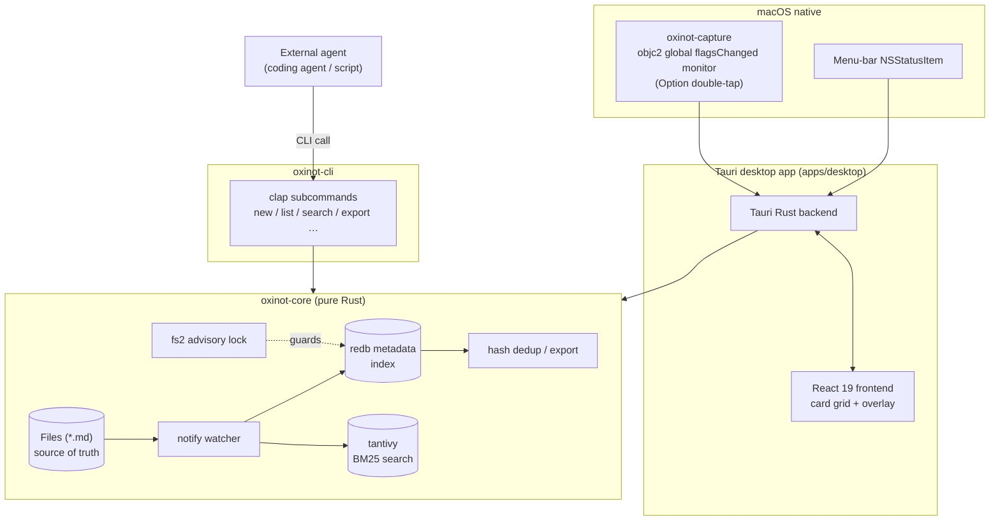

<div align="center">

# oxinot

**Capture a thought before it's gone.**

A fast, minimal, card-based memo app for macOS (Apple Silicon).

Where a human hits `Option` twice and a coding agent reads the same vault over a CLI — with parity, no cloud, and plain-text files as the source of truth.

[](https://github.com/project-oxi/oxinot/actions/workflows/ci.yml)
[](https://github.com/project-oxi/oxinot/releases)
[](LICENSE)
[](https://www.rust-lang.org)
[](https://v2.tauri.app)
[](#system-requirements)

</div>

---

> **oxinot** is optimized for the *speed of catching a thought*. Every memo is a **card**; cards live on a **grid**. There is no AI summary, no auto-tagging, no chatbot — those trade away the capture speed and reliability this project exists to protect.

Two core scenarios, one vault:

1. **A human** double-taps `Option` anywhere on macOS, types one line, and disappears back into their work.
2. **An agent** (coding agent, local script) reads and writes those same notes over the `oxinot` CLI — safely, with no duplicates.

## Highlights

- **Files are the source of truth.** Notes are plain `.md` files with TOML frontmatter. `grep` and `cat` work. The index is just a cache — rebuildable at any time with `oxinot reindex`.
- **Three-tier storage, pure Rust.** Plain files + a `redb` metadata index + a `tantivy` BM25 full-text index. No SQLite, no C dependencies in the index layer.
- **Capture that doesn't make you wait.** The overlay window is warmed up off-screen so it appears in a single frame (target ≤ 16 ms) on trigger.
- **Human/agent parity.** Every GUI operation is a CLI operation. Agent-facing commands default to **JSON / NDJSON** for clean streaming and scripting.
- **Hash-based sync.** `oxinot export` emits a body-less manifest of `{id, hash, updated_at, deleted}`; diff the hashes, fetch only what changed, advance your cursor. Handles `ARG_MAX` with `--ids-file` / `--ids-stdin`.
- **OKLCH colors.** Perceptually uniform, CSS-native color labels that look right in both light and dark mode.
- **Hardened against external writes.** The file watcher debounces, retries partial writes (editors, iCloud), and never crashes the indexer.

## Table of contents

- [System requirements](#system-requirements)
- [Install](#install)
- [Quick start (CLI)](#quick-start-cli)
- [The vault](#the-vault)
- [Architecture](#architecture)
- [Project structure](#project-structure)
- [Synchronization for agents](#synchronization-for-agents)
- [Development](#development)
- [Roadmap](#roadmap)
- [Contributing](#contributing)
- [License](#license)

## System requirements

- **macOS 14+** on **Apple Silicon** (`aarch64-apple-darwin`).
- Rust 1.89+ (edition 2024) to build from source.

Windows, Linux, and mobile are intentionally out of scope for the MVP. See the [design doc](doc/DESIGN.md).

## Install

### From a release

Download the prebuilt `oxinot` binary and `.dmg` from the
[latest release](https://github.com/project-oxi/oxinot/releases), then:

```bash
tar -xzf oxinot-aarch64-apple-darwin.tar.gz
sudo install -m 0755 oxinot /usr/local/bin/oxinot
oxinot --version
```

### From source

```bash
git clone https://github.com/project-oxi/oxinot.git
cd oxinot
cargo build --release -p oxinot-cli
# binary: target/release/oxinot
```

> A Homebrew tap (`brew install`) is planned. For now, use a release tarball or build from source.

## Quick start (CLI)

The CLI is the authoritative interface — the same `oxinot-core` the desktop app uses.

```bash
# Capture a thought (text arg, or omit to read stdin)
oxinot new "Ship the redb bump before the freeze" --tag backlog --color "oklch(0.75 0.15 75)"

# List recent notes — table for humans (default), JSON/NDJSON for agents
oxinot list --limit 10
oxinot list --favorites --format ndjson

# Read one memo (JSON by default; --md for the raw file)
oxinot get 019fa927-a897-7e12-9102-8a8c7ebbb594 --md

# Full-text search (BM25 over body + tags)
oxinot search "redb upgrade" --limit 5 --format ndjson

# Where does my vault live?
oxinot vault path
```

<details>
<summary><strong>Full command reference</strong></summary>

```bash
oxinot new [TEXT] [--tag TAG]… [--color "oklch(...)"]      # arg or stdin; empty rejected
oxinot list [--limit N] [--tag T] [--favorites] [--format table|json|ndjson]
oxinot get <ID> [--md]
oxinot search <QUERY> [--limit N] [--format json|ndjson]
oxinot export [--since RFC3339] [--ids a,b,c | --ids-file PATH | --ids-stdin]
              [--full] [--format ndjson|json]
oxinot delete <ID>                                          # soft-delete → .trash/
oxinot purge [--older-than 30d]
oxinot reindex                                              # rebuild indexes from files
oxinot doctor [--fix]                                       # audit / safe-repair
oxinot vault path                                           # print the vault root
```

Global: `--vault <PATH>` (or `OXINOT_VAULT`) selects a non-default vault. Output formats: `table` (human), `json` (single array), `ndjson` (one value per line, the default for `export`/`search`). Timestamps are RFC 3339.

</details>

<details>
<summary><strong>Global capture & desktop app</strong></summary>

- **Capture overlay:** double-tap `Option` (needs Accessibility / Input Monitoring permission), or the always-available `Cmd+Shift+N`, or the menu-bar icon. `Enter` saves & dismisses, `Shift+Enter` newline, `Esc` cancels.
- **Card grid:** search, tag/favorite filters, OKLCH color labels, virtualized for large vaults.
- Light/dark follows the macOS system appearance.

</details>

## The vault

Notes are plain text — humans and agents can read them with anything.

```plain
vault/
├── memos/
│   └── 2026/07/
│       ├── 01991a2e-7c3f-7c91-9f3e-6b1a2e8f9c10.md
│       └── 01991a31-9b10-70aa-8c2e-4f0a1d2b3c44.md
├── .trash/          # soft-deleted memos
└── config.toml      # optional vault settings
```

Each memo is one file with TOML frontmatter delimited by `+++`:

```markdown
+++
id = "01991a2e-7c3f-7c91-9f3e-6b1a2e8f9c10"
created_at = "2026-07-28T10:15:03+09:00"
updated_at = "2026-07-28T10:15:03+09:00"
hash = "b3:6f2a9e1d4c7b8a90f1e2d3c4b5a6978…"
favorite = false
color = "oklch(0.75 0.15 75)"
tags = ["idea", "oxinot"]
+++

The capture overlay must appear in under one frame.
```

The `id` is a time-sortable **UUIDv7**; the `hash` is **`b3:` + BLAKE3** over the normalized body, tags, favorite flag, and color — so a pure metadata edit (add a tag, change a color) bumps the hash and is detected by sync. Full parsing rules and the safe-writing guide are in [`doc/DESIGN.md`](doc/DESIGN.md) §5 and [`skills/oxinot/SKILL.md`](skills/oxinot/SKILL.md).

## Architecture

`oxinot-core` is a pure-Rust library that owns the file store, indexes, file-watching, and sync. The desktop app (Tauri) and the CLI are **thin adapters** over [`oxinot_core::Vault`](crates/oxinot-core/src/vault.rs) — so the GUI and CLI always behave identically and can share one live vault (guarded by an `fs2` advisory lock).



| Layer | Role | Tech |
| :--- | :--- | :--- |
| Source of truth | Human-readable memo bodies | `.md` files + TOML frontmatter |
| Metadata index | Fast pagination, filters, sync cursor | `redb` |
| Full-text index | BM25 keyword search | `tantivy` |

The index layers are 100% derivable from the files — corrupt or stale? One `oxinot reindex` restores them.

## Project structure

```
oxinot/
├── crates/
│   ├── oxinot-core/      # Pure-Rust core: store, index, search, watcher, sync
│   ├── oxinot-cli/       # `oxinot` binary — clap adapter over oxinot-core
│   └── oxinot-capture/   # macOS global Option double-tap monitor (objc2)
├── apps/desktop/         # Tauri 2 + React 19 desktop app
│   ├── src-tauri/        #   Rust backend
│   └── src/              #   React frontend (Tailwind v4, Base UI, TanStack)
├── skills/oxinot/        # SKILL.md — agent-facing CLI guide
└── doc/DESIGN.md         # Full design document
```

## Synchronization for agents

The manifest is cheap on purpose — bodies are omitted, so it stays light for tens of thousands of notes.

1. **Fetch the manifest since your cursor:**
   ```bash
   oxinot export --since "$CURSOR" --format ndjson > manifest.ndjson
   ```
2. **Diff against your local `id → hash` cache** (in your code):
   - `id` unseen → **fetch**
   - `hash` differs → **fetch** (covers tag/favorite/color edits too)
   - `deleted: true` → **drop**
3. **Fetch changed bodies in bulk** (use `--ids-file`/`--ids-stdin` past `ARG_MAX`):
   ```bash
   oxinot export --ids-file ids.txt --full --format ndjson
   ```
4. **Advance your cursor** to the max `updated_at` seen. Repeat.

The full procedure, output schemas, and the safe direct-write rules are in [`skills/oxinot/SKILL.md`](skills/oxinot/SKILL.md).

## Development

```bash
# Rust
cargo fmt
cargo clippy -p oxinot-core -p oxinot-cli -p oxinot-capture --all-targets -- -D warnings
cargo test -p oxinot-core -p oxinot-cli -p oxinot-capture

# Desktop frontend
cd apps/desktop
bun install
bun run build
```

A scratch vault is handy for manual testing:

```bash
cargo run -p oxinot-cli -- --vault /tmp/oxinot-test new "hello" --tag dev
cargo run -p oxinot-cli -- --vault /tmp/oxinot-test list
```

See [`CONTRIBUTING.md`](CONTRIBUTING.md) for the full workflow, and [`doc/DESIGN.md`](doc/DESIGN.md) for the design authority.

## Roadmap

- **v0.3+** — MCP server mode (`oxinot mcp serve`), multiple vaults, iCloud-Drive vault auto-detection, optional wikilinks/backlinks.
- **Deferred by design** — AI summaries, auto-tagging, chatbot, and embedding-based semantic search. BM25 keeps the capture loop fast; an offline embedding path (Rust `candle`, Metal-accelerated) stays a possibility if real demand appears.

## Contributing

Contributions are welcome! Please read [`CONTRIBUTING.md`](CONTRIBUTING.md) first.

By contributing, you agree your contributions will be licensed under the
[MIT License](LICENSE).

## License

Licensed under the [MIT License](LICENSE).

Unless you explicitly state otherwise, any contribution intentionally submitted
for inclusion in this project by you shall be licensed under the MIT License,
without any additional terms or conditions.
