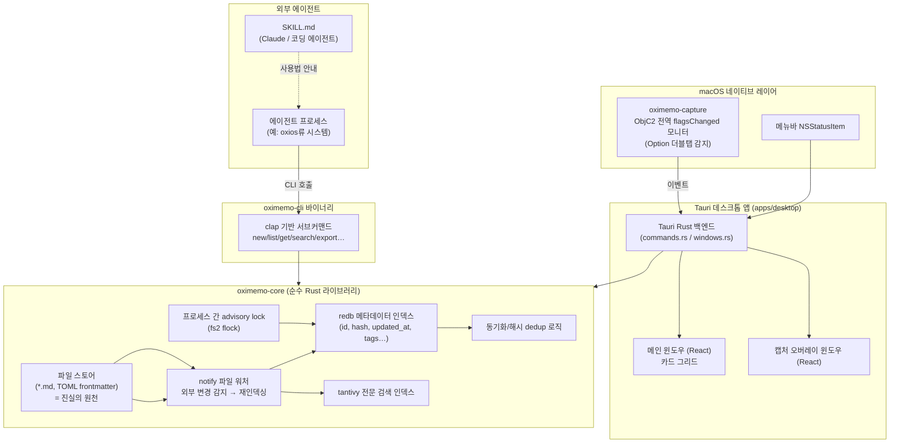

> Canonical unified design system: `project-oxi/.github/DESIGN.md` — this file is project-specific (oximemo product · data · CLI design).

> macOS(Apple Silicon) 전용, 미니멀 카드형 빠른 메모 캡처 앱
> Rust + Tauri 2 · React · 헤드리스 UI · 순수 Rust 코어 · CLI/Skill로 코딩 에이전트 연동

- 버전: v0.2
- 작성일: 2026-07-28
- 대상 플랫폼: macOS 14+ on Apple Silicon ( `aarch64-apple-darwin` 단일 타겟)
- 언어/런타임: Rust 1.97+ (2024 edition) · TypeScript 5 · React 19
- 디자인 시스템: **`UNIFIED-DESIGN.md`** (oxi 생태계 통합 — OKLCH 색상·타이포그래피·토큰 계층·컴포넌트 스펙). 이 문서는 제품·데이터·CLI 설계에 집중하며, 시각 토큰은 통합 문서를 따른다.

---

## 1. 개요

**oximemo**는 "생각을 붙잡아 두는 속도"에 최적화된 메모 앱입니다. 각 메모는 하나의 **카드**이고, 카드들은 **그리드**에 배치됩니다. AI 요약, 자동 태깅, 챗봇 같은 기능은 없습니다 — 그런 기능이 캡처 속도와 신뢰성을 해친다고 보기 때문입니다.

핵심 사용 시나리오는 두 가지입니다.

1. **사람**이 macOS에서 `Option` 키를 빠르게 두 번 눌러 어디서든 즉시 캡처 오버레이를 띄우고, 한 문장을 적고 사라진다.
2. **에이전트**(코딩 에이전트, 로컬 자동화 스크립트 등)가 CLI와 Skill을 통해 그 메모들을 안전하고 중복 없이 읽어간다.

이 문서는 이 두 시나리오를 뒷받침하는 데이터 모델, 저장소 구조, 네이티브 캡처 메커니즘, UI 구성, CLI/Skill 명세를 정의합니다. 이 문서를 기준으로 그린필드 구현을 시작합니다.

---

## 2. 설계 철학

세 가지 원칙을 우선순위 순서로 둡니다.

1. **캡처는 신경 쓸 겨를이 없어야 한다.**  오버레이가 뜨는 데 지연이 있으면 안 되고, 저장에 실패하면 안 되고, 저장 후 즉시 원래 작업으로 돌아갈 수 있어야 합니다.
2. **파일이 진실이다.**  DB나 인덱스가 깨져도 메모는 사람이 읽을 수 있는 평문 파일로 디스크에 남아 있어야 합니다. 인덱스는 언제든 파일로부터 재생성 가능한 "캐시"로 취급합니다.
3. **적을수록 좋다.**  리치 텍스트 에디터, AST 파서, 클라우드 동기화 프로토콜처럼 복잡도가 큰 컴포넌트는 기본적으로 배제하고, 정말 필요할 때만 최소 형태로 추가합니다.

참고 프로젝트로 [zakirullin/files.md](https://github.com/zakirullin/files.md)를 검토했고, 다음 아이디어들을 oximemo에 맞게 가져옵니다.

| files.md에서 확인한 것                                                                  | oximemo에 적용                                                         |
| :-------------------------------------------------------------------------------- | :----------------------------------------------------------------- |
| 모든 것을 평문 `.md` 파일로 저장, "LLM-friendly"를 명시적 목표로 삼음                                 | 노트 원본을 평문 마크다운 파일로 저장 (§5.2)                                       |
| 인박스 항목을 위치 인덱스가 아니라 **내용 해시**로 식별해 항목이 추가/삭제돼도 참조가 깨지지 않게 함 (ADR)                 | 노트 식별에 `id` + `content hash`를 함께 사용해 CLI 동기화의 중복 판별 기준으로 삼음 (§9.2) |
| 동기화에는 `mtime`(내용 변경), 삭제 추적에는 `ctime`을 분리해서 사용 — "mtime이 더 신뢰할 수 있다"는 결론에 도달한 ADR | 증분 export의 커서를 자체 발급 seq가 아니라 `updated_at`(내용 갱신 시각)으로 삼음 (§5.3)   |
| `llms.txt` / `AGENTS.md`에 파일 구조를 문서화해 에이전트가 이해하게 함                                | Claude Skill( `SKILL.md`)로 CLI 사용법과 동기화 워크플로를 에이전트에 문서화 (§10)      |
| AST 마크다운 파서를 포기하고 단순한 파서로 교체 (복잡도 3배 감소)                                          | 카드 미리보기는 완전한 마크다운 렌더링 대신 아주 제한된 인라인 서식만 지원 (§7.3)                  |
| 텔레그램 봇 = "산만하지 않은 쓰기 전용 입구"                                                       | Option 더블탭 오버레이 = 동일한 역할을 로컬 네이티브로 수행 (§6)                         |

---

## 3. 범위 정의

### MVP에 포함

- 카드 그리드 메인 창 (검색, 태그, 즐겨찾기, OKLCH 색상 라벨)
- `Option` 더블탭 전역 캡처 오버레이 (+ 대체 단축키, 메뉴바 아이콘)
- 노트 CRUD, 소프트 삭제(휴지통)
- 로컬 전문 검색 (BM25)
- CLI: 생성/목록/조회/검색/삭제/내보내기/재인덱싱
- 에이전트용 Skill 패키지 ( `SKILL.md`)
- 라이트/다크 모드, macOS 네이티브 톤

### 명시적 비범위 (MVP)

- AI 요약, 자동 태깅, 챗봇, 임베딩 기반 의미 검색 (§14에서 후순위로 재논의)
- 리치 텍스트/WYSIWYG 에디터, 이미지·첨부파일 (Phase 2 후보)
- 다중 기기 동기화 프로토콜 자체 구현 (볼트 폴더를 iCloud Drive 등에 두는 것은 사용자 선택으로 허용하되, oximemo이 동기화 로직을 직접 구현하지 않음)
- Windows/Linux/모바일 지원, App Store 배포
- 노트 간 위키링크·백링크 그래프 (파일 기반 마크다운 링크로 열어두되 MVP 기능은 아님)

---

## 4. 시스템 아키텍처 개요



핵심 결정: **오버레이/그리드 UI, CLI, 코어 로직을 별도의 Cargo 크레이트로 분리**합니다. `oximemo-core`는 Tauri나 clap에 대해 전혀 알지 못하는 순수 라이브러리로, 파일 I/O·해시·인덱싱·동기화 로직을 전담합니다. Tauri 앱과 CLI는 둘 다 이 코어를 감싸는 얇은 어댑터일 뿐입니다. 이렇게 하면:

- CLI와 GUI가 동시에 열려 있어도 같은 볼트를 안전하게 공유합니다 (§5.7 프로세스 간 락 참조).
- 코어 로직을 유닛 테스트하는 데 UI나 IPC가 전혀 필요 없습니다.
- 나중에 MCP 서버(§10.3)나 다른 프론트엔드를 추가해도 코어를 재사용합니다.

---

## 5. 데이터 모델과 저장소

### 5.1 저장 계층 3단 구조

| 계층                   | 역할                            | 기술                               | 위치                                                                                |
| :------------------- | :---------------------------- | :------------------------------- | :-------------------------------------------------------------------------------- |
| 원본 (source of truth) | 사람·에이전트가 직접 읽을 수 있는 노트 본문     | 개별 `.md` 파일 + TOML frontmatter   | 사용자가 지정한 **Vault 폴더** (기본: `~/Library/Application Support/com.oximemo.app/vault/`) |
| 메타데이터 인덱스            | 그리드 페이지네이션, 필터, 동기화 커서용 빠른 조회 | `redb` (순수 Rust 임베디드 KV/테이블 스토어) | 로컬 전용 캐시 경로: `~/Library/Application Support/com.oximemo.app/index/meta.redb`       |
| 전문 검색 인덱스            | BM25 키워드 검색                   | `tantivy`                        | `…/index/search/`                                                                 |

**왜 3단인가:**  인덱스 계층(redb, tantivy)은 언제든 Vault 폴더를 다시 스캔해서 100% 재생성할 수 있는 "파생 데이터"로 설계합니다. 이렇게 하면 인덱스가 손상되거나 앱 버전이 바뀌어 스키마가 달라져도 `oximemo reindex` 한 번으로 복구됩니다. 반대로 Vault 폴더는 절대 자동으로 손댈 필요가 없는 순수 텍스트 뭉치이므로, 에이전트가 CLI 없이 `grep`이나 `cat`으로 직접 들여다봐도 안전합니다.

**"순수 Rust" 원칙과의 관계:**  SQLite(FTS5)는 성숙하고 검증된 선택지지만 C 라이브러리를 번들링합니다. 이번 프로젝트는 명시적으로 "순수 Rust"를 요구했고, 트렌드도 부합하므로 `redb`(임베디드 KV, lmdb에 영감을 받은 순수 Rust 구현) + `tantivy`(Lucene에 영감을 받은 순수 Rust 검색 엔진, Quickwit 팀이 유지)를 기본값으로 채택합니다. 둘 다 활발히 유지보수되고 있고 실사용 벤치마크에서 lmdb/rocksdb에 준하는 성능을 보입니다. 다만 이 인덱스 계층은 언제든 SQLite+FTS5로 교체 가능하도록 `oximemo-core` 내부에 `trait MemoIndex`, `trait SearchIndex` 경계를 두어 스토리지 구현을 갈아끼울 수 있게 설계합니다.

### 5.2 노트 파일 포맷

한 노트 = 한 파일 = 한 카드. 파일명은 `id`(아래 참조)이고, 디렉토리는 생성일 기준으로 샤딩합니다 (macOS APFS는 큰 평면 디렉토리도 잘 처리하지만, 사람이 Finder로 훑어보거나 에이전트가 날짜 범위로 `grep`하기 편하도록 샤딩합니다).

```plain
vault/
├── notes/
│   ├── 2026/
│   │   ├── 07/
│   │   │   ├── 01991a2e-7c3f-7c91-9f3e-6b1a2e8f9c10.md
│   │   │   └── 01991a31-9b10-70aa-8c2e-4f0a1d2b3c44.md
│   │   └── 08/
│   └── 2025/
├── .trash/                       # 소프트 삭제된 노트 (§5.4)
└── config.toml                   # 볼트 설정 (§5.8)
```

개별 노트 파일 예시:

```markdown
+++
id = "01991a2e-7c3f-7c91-9f3e-6b1a2e8f9c10"
created_at = "2026-07-28T10:15:03+09:00"
updated_at = "2026-07-28T10:15:03+09:00"
hash = "b3:6f2a9e1d4c7b8a90f1e2d3c4b5a6978..."
favorite = false
category = "idea"
tags = ["idea", "oximemo"]
+++

Option 더블탭 오버레이는 반드시 300ms 안에 떠야 한다.
```

**왜 YAML이 아니라 TOML frontmatter인가:**  `+++` 구분자를 쓰는 TOML frontmatter(Hugo/Zola 스타일)를 채택합니다. Rust의 `toml` 크레이트는 Cargo 생태계 자체가 의존하는 1급 시민이라 유지보수 리스크가 낮고, YAML 파서 진영(예: `serde_yaml`)은 최근 몇 년간 유지보수 상태가 유동적이었습니다. 사람이 읽기에도 TOML은 리스트·불리언·문자열 구분이 명확해 프론트매터 용도로 충분히 가볍습니다.

**frontmatter 파싱 규칙 (엄격):**

파서는 다음 규칙을 **엄격히** 적용합니다:

1. 파일의 **첫 번째 줄**이 정확히 `+++`(앞뒤 공백 없음)여야 frontmatter가 존재하는 것으로 인식합니다.
2. 첫 줄 이후 **두 번째로 나타나는** `+++`\*\* 줄\*\*까지가 frontmatter 블록입니다.
3. 두 번째 `+++` 이후의 모든 내용은 본문(body)으로 취급합니다. 본문 중간에 `+++`로 시작하는 줄이 나타나더라도 파싱에 영향을 주지 않습니다.
4. 첫 줄이 `+++`가 아닌 파일은 frontmatter가 없는 순수 본문 파일로 취급합니다 (외부에서 생성된 `.md` 파일 호환).
5. frontmatter 블록 내 TOML 파싱에 실패하면 해당 파일을 `doctor` 보고서에 "손상된 frontmatter"로 기록하고, 본문만 인덱싱합니다 (앱이 크래시하지 않음).

이 규칙은 SKILL.md와 사용자 문서에 명시하여, 에이전트가 파일을 직접 쓸 때도 올바른 포맷을 따르도록 합니다.

### 5.3 ID·해시·타임스탬프 전략

| 필드                          | 형식                           | 목적                                              |
| :-------------------------- | :--------------------------- | :---------------------------------------------- |
| `id`                        | UUIDv7                       | 생성 시각이 인코딩된 시간 정렬 가능한 고유 식별자. 파일명이자 카드의 영구 식별자. |
| `hash`                      | `b3:` + BLAKE3 hex           | **내용** 변경 감지용. 알고리즘 접두어를 붙여 향후 교체 가능하게 함        |
| `created_at` / `updated_at` | RFC 3339 (타임존 포함, 마이크로초 정밀도) | 정렬, 동기화 커서                                      |

**해시 정규화 규칙** (트리비얼한 포맷 차이로 해시가 흔들리지 않도록):

1. 줄바꿈을 `\n`으로 통일
2. 각 줄의 트레일링 공백 제거
3. 유니코드 NFC 정규화
4. 파일 끝 개행 하나로 통일
5. 위 결과 UTF-8 바이트열의 BLAKE3 해시를 hex로 인코딩

**왜 자체 발급 시퀀스 번호(seq) 대신** `updated_at`**을 동기화 커서로 쓰는가:**  files.md ADR에서 이미 겪은 문제입니다 — 만약 로컬 인덱스가 손상돼 `oximemo reindex`로 재생성하면, 파일을 다시 스캔하는 순서에 따라 자체 발급 seq가 이전과 달라질 수 있습니다. 그러면 에이전트가 들고 있던 "seq 커서"가 무의미해집니다. 반면 `updated_at`은 노트 파일 자체(frontmatter)에 저장되므로 재인덱싱해도 값이 변하지 않습니다. 동기화 커서는 `(updated_at, id)` 튜플로 정의해 동시각 충돌을 `id`(UUIDv7이라 이 역시 시간 정렬됨)로 타이브레이크합니다.

### 5.4 삭제(트래시) 처리

- `oximemo delete <id>` 는 파일을 즉시 지우지 않고 `notes/…/id.md` → `.trash/id.md` 로 이동하고 frontmatter에 `deleted_at`을 기록합니다.
- redb 인덱스는 해당 레코드를 툼스톤(tombstone)로 표시해 둡니다. `export`/ `list --since`는 `deleted: true` 레코드도 함께 반환해 에이전트가 로컬 캐시에서 제거할 수 있게 합니다.
- 기본 30일(설정 가능) 경과 후 `oximemo purge`(수동 또는 앱 실행 시 백그라운드)로 완전 삭제합니다.
- 이 구조 덕분에 "실수로 지운 메모 복구"와 "에이전트에게 삭제 사실을 정확히 전파"를 같은 메커니즘으로 해결합니다.

### 5.5 파일 변경 감지 & 재인덱싱

`notify` 크레이트로 Vault 폴더를 감시합니다. 목적은 두 가지입니다.

1. **사용자가 파일을 직접 편집**했을 때(예: 다른 에디터로 열어 수정, 또는 iCloud로 다른 기기에서 동기화되어 들어온 변경) 앱이 자동으로 감지해 redb/tantivy를 갱신합니다.
2. **에이전트가 CLI 없이 파일을 직접 썼을 때**도 동일하게 반영됩니다 (oximemo은 파일 쓰기 권한을 독점하지 않습니다).

**외부 쓰기 견고성 보장:**

외부 에디터와 iCloud Drive는 oximemo이 제어하지 않는 방식으로 파일을 씁니다. 다음 시나리오를 반드시 처리해야 합니다:

| 시나리오                    | 문제                                | 대응             |
| :---------------------- | :-------------------------------- | :------------- |
| vim/emacs 저장            | swap → rename (대부분 안전)            | 일반 경로로 처리      |
| VS Code "Auto Save"     | in-place truncate + write 가능      | debounce 후 재읽기 |
| iCloud Drive 동기화        | 부분 쓰기 상태 파일 일시 노출                 | 파싱 실패 시 재시도    |
| `echo "text" > file.md` | shell redirect = truncate + write | debounce 후 재읽기 |

**구현 규칙:**

1. 워처 콜백에서 파일을 즉시 읽지 않고 **300ms debounce** 후 읽습니다 (연속 이벤트 병합).
2. 파일 읽기 후 frontmatter 파싱 + 해시 재계산을 시도합니다.
3. 파싱 실패 시 **200ms 간격으로 최대 2회 재시도**합니다 (iCloud 부분 쓰기 대응).
4. 3회 모두 실패하면 해당 파일을 "파싱 보류" 큐에 넣고, 다음 워처 이벤트 또는 `reindex` 시 재시도합니다. 앱은 크래시하지 않습니다.
5. 해시가 기존과 다르면 `updated_at` 갱신 + tantivy 문서 재색인. 같으면 스킵.

변경 감지 시 처리: 파일을 다시 읽어 frontmatter 파싱 → 해시 재계산 → 기존 `hash`와 다르면 `updated_at` 갱신 + tantivy 문서 재색인. oximemo 자신이 쓰는 경우는 항상 "임시 파일에 쓰고 `rename`으로 원자적 교체" 패턴을 사용합니다.

### 5.6 대용량 노트 스케일 대응

"작은 메모가 아주 많다"를 기본 가정으로 설계합니다. 목표 수치(비구속적 가이드라인, §13 참조): 노트 10만 개, 평균 본문 200B\~2KB.

- 메타데이터 조회는 항상 **커서 기반 페이지네이션**( `updated_at`/ `id` 커서)으로만 이루어지고, "전체 노트 개수만큼 SELECT"는 어떤 경로에서도 금지합니다.
- React 쪽 카드 그리드는 반드시 가상화(§7.2)해서 DOM에는 화면에 보이는 카드만 존재합니다.
- 검색은 tantivy 인덱스를 거치며, 파일 시스템 전수 스캔은 오직 `oximemo reindex`(명시적 복구 명령)에서만 발생합니다.
- 인덱스 쓰기는 UI 스레드를 막지 않도록 Tauri의 async command + 백그라운드 태스크로 처리하고, 연속 타이핑 중 저장은 디바운스(300\~500ms)합니다.

### 5.7 프로세스 간 동시성 — redb 락 전략

**문제:**  redb는 단일 프로세스 내 단일 writer를 보장하지만, **프로세스 간 락을 제공하지 않습니다.**  GUI 앱과 CLI가 동시에 같은 `meta.redb` 파일을 열면 데이터 손상이 발생할 수 있습니다.

**결정:** `fs2`\*\* 크레이트를 사용한 advisory file lock.\*\*

```plain
index/
├── meta.redb
├── meta.redb.lock        ← flock 대상 파일
└── search/
    └── .lock             ← tantivy writer 락
```

**규칙:**

1. `oximemo-core`의 `IndexAccess` 모듈이 redb/tantivy를 열기 전에 반드시 `meta.redb.lock`에 **exclusive flock**을 획득합니다.
2. 읽기 전용 작업(목록 조회, 검색)은 **shared flock**을 사용합니다 (다중 리더 허용).
3. 쓰기 작업(노트 생성/수정/삭제 → 인덱스 갱신)은 **exclusive flock**을 사용합니다.
4. 락 획득 실패 시(다른 프로세스가 exclusive 보유): 최대 5초 대기 후 타임아웃 에러를 반환합니다. CLI는 "다른 oximemo 프로세스가 인덱스를 사용 중입니다" 메시지를 표시합니다.
5. **파일 스토어(원본 .md)는 락 대상이 아닙니다.**  파일 쓰기는 원자적 rename으로 보호되므로, 인덱스 락 없이도 파일 직접 읽기/쓰기는 안전합니다.

**CLI 단독 사용 시나리오:**  CLI가 GUI 없이 단독 실행되면 락 경합이 없으므로 정상 동작합니다. GUI가 백그라운드에 있으면 CLI가 exclusive 락을 기다릴 수 있지만, 인덱스 쓰기 트랜잭션은 보통 1ms 이내이므로 체감 지연은 없습니다.

**대안 검토:**  "CLI는 인덱스를 열지 않고 파일 스캔만 한다"는 옵션도 고려했으나, 이 경우 `oximemo search`(tantivy)와 `oximemo list`(redb 페이지네이션)가 CLI에서 동작하지 않게 되어 에이전트 연동의 핵심 가치가 훼손됩니다. advisory lock 방식이 복잡도와 기능 보존의 최적 균형점입니다.

### 5.8 볼트 설정 ( `config.toml`)

볼트 루트에 선택적 `config.toml`을 둡니다. 없으면 모든 값이 기본값으로 동작합니다.

```toml
# vault/config.toml — oximemo 볼트 설정

[general]
trash_retention_days = 30          # 휴지통 자동 퍼지 주기

[capture]
double_tap_threshold_ms = 350      # Option 더블탭 판정 임계값
overlay_max_height = 400           # 오버레이 최대 높이 (px)

[appearance]
theme = "system"                   # "system" | "light" | "dark"
show_dock_icon = true              # false = 메뉴바 전용 (LSUIElement)

[color]
# OKLCH 색상 팔레트 (§7.7 참조)
# 사용자가 UI에서 선택할 수 있는 프리셋 색상 목록
presets = [
    "oklch(0.75 0.15 25)",         # red
    "oklch(0.75 0.15 75)",         # amber
    "oklch(0.75 0.13 145)",        # green
    "oklch(0.70 0.14 250)",        # blue
    "oklch(0.72 0.15 310)",        # purple
    "oklch(0.75 0.12 195)",        # teal
]

[index]
watcher_debounce_ms = 300          # 파일 워처 디바운스
watcher_retry_count = 2            # 파싱 실패 재시도 횟수
watcher_retry_interval_ms = 200    # 재시도 간격
```

**스키마 버전 관리:**  `config.toml`에 `schema_version = 1` 필드를 두고, 향후 스키마 변경 시 하위 호환 파싱(알 수 없는 필드 무시, 누락 필드 기본값)을 보장합니다.

---

## 6. 빠른 캡처 — Option 더블탭

### 6.1 감지 메커니즘

macOS에서 "수정자 키 단독 두 번 탭"은 표준 전역 단축키 API( `RegisterHotKey`류)로는 감지할 수 없습니다 — 이런 API는 항상 일반 키 하나 이상을 요구합니다. Alfred, Raycast류 앱이 쓰는 것과 같은 방식으로, **AppKit의 전역 이벤트 모니터**를 사용합니다.

- `objc2` + `objc2-app-kit` 크레이트로 `NSEvent::addGlobalMonitorForEvents(matching: .flagsChanged)`를 호출하는 네이티브 모듈( `crates/oximemo-capture`)을 별도로 둡니다. (이 이벤트를 **소비/차단**할 필요가 없으므로 `CGEventTap`이 아니라 패시브 모니터인 `NSEvent` global monitor로 충분합니다 — Option 키는 다른 앱에서 계속 정상 동작해야 합니다.)
- 감지 로직: `flagsChanged` 이벤트에서 Option 키(좌/우 모두)가 **단독으로** 눌렸다가 뗀 시점을 기록. 직전 기록과의 간격이 임계값(기본 350ms, 설정 가능) 이내면 "더블탭"으로 판정.
- 다른 수정자나 일반 키가 동시에 눌린 경우(예: `Option+E`로 악센트 문자 입력, 다른 앱의 `Option+숫자` 단축키)는 애초에 `flagsChanged` 단독 이벤트가 아니므로 자연스럽게 걸러집니다.
- 이 모니터는 Tauri `setup()` 훅에서 별도 OS 스레드 + 자체 `CFRunLoop`로 구동하고, 감지 시 Tauri 이벤트( `capture:trigger`)를 메인 앱으로 전달합니다.

### 6.2 권한 처리

전역 키 이벤트 모니터링은 **손쉬운 사용(Accessibility) / 입력 모니터링** 권한이 필요합니다( `AXIsProcessTrusted`). 최초 실행 시:

1. 왜 권한이 필요한지 설명하는 온보딩 화면 표시
2. `AXIsProcessTrustedWithOptions`로 권한 프롬프트 유도, 또는 시스템 설정 딥링크( `x-apple.systempreferences:com.apple.preference.security?Privacy_Accessibility`)로 안내
3. 권한이 거부되어도 앱은 정상 동작해야 함 — 이 경우 더블탭 캡처만 비활성화되고 §6.4의 대체 수단(메뉴바 클릭, 일반 단축키)으로 캡처 가능함을 명확히 안내

### 6.3 오버레이 창

- Tauri 멀티 윈도우 기능으로 `capture`라는 별도 윈도우를 앱 시작 시 생성합니다.

- **Warm-up 전략:**  Tauri 2에서 `visible: false`로 생성한 윈도우는 macOS에서 NSWindow가 실제로 할당되지 않을 수 있어 첫 `show()` 시 50\~150ms 지연이 발생할 수 있습니다. 이를 회피하기 위해:
  1. 윈도우를 **화면 밖 좌표**(예: `x: -9999, y: -9999`)에 `visible: true`로 생성합니다.
  2. React 측에서 마운트 완료 후 `capture:ready` 이벤트를 Rust로 보냅니다 (DOM warm-up 확인).
  3. 트리거 시: `setPosition()`으로 마우스 커서 화면의 중앙 상단부로 이동 → `setFocus()`. 이 경로는 NSWindow 재할당이 없으므로 **≤ 16ms(1프레임)**  내에 표시됩니다.
  4. 닫을 때는 다시 화면 밖으로 이동 + `setFocus()` 해제 (hide가 아님).

- 윈도우 속성: `decorations: false`, `transparent: true`, `alwaysOnTop: true`, `skipTaskbar: true`, `resizable: false`, 크기 약 560×140(입력이 늘어나면 최대 높이까지만 자동 확장).

- macOS 비주얼 이펙트(블러/vibrancy) 배경을 적용해 다른 네이티브 오버레이(Spotlight 등)와 톤을 맞춥니다.

- 인터랙션: 자동 포커스된 단일 텍스트 영역. `Enter` = 저장 후 닫기, `Shift+Enter` = 줄바꿈, `Esc` = 취소 후 닫기. 저장 시 짧은 체크마크 피드백 후 오버레이가 사라집니다.

- 저장은 `create_memo` 커맨드를 그대로 재사용합니다(§8) — 오버레이와 메인 창이 노트 생성 경로를 공유합니다.

### 6.4 상시 접근 (메뉴바 & 대체 단축키)

- 앱은 **메뉴바 상주 아이콘**( `NSStatusItem`)을 항상 띄웁니다 — 클릭 시 캡처 오버레이, 옵션 클릭 시 메인 창.
- Dock 아이콘 표시 여부는 설정으로 선택 가능(기본은 표시, "메뉴바 전용" 모드 제공).
- `tauri-plugin-global-shortcut`으로 일반 단축키(기본값 `Cmd+Shift+N`, 사용자 재설정 가능)를 항상 등록해, 손쉬운 사용 권한이 없거나 더블탭 방식이 다른 워크플로와 충돌할 때의 대체 수단으로 제공합니다.

### 6.5 배포 고려사항

- Apple Silicon 단일 타겟이므로 빌드는 `aarch64-apple-darwin`만 타겟팅합니다(유니버설 바이너리 불필요, 빌드 시간 단축).
- Developer ID 서명 + 공증(notarization) + Hardened Runtime 필요 (전역 이벤트 모니터링 및 배포용 `.dmg` 배포를 위해). Input Monitoring 관련 entitlement를 `Info.plist`/entitlements에 명시합니다.
- 메뉴바 상주 특성상 `LSUIElement`(Dock 숨김) 옵션도 설정으로 지원합니다.

---

## 7. 메인 앱 UI — 카드 그리드

### 7.1 스택

| 영역          | 선택                              | 비고                                                                                                      |
| :---------- | :------------------------------ | :------------------------------------------------------------------------------------------------------ |
| 프레임워크       | React 19 + TypeScript 5         | Tauri 2 공식 지원 조합                                                                                        |
| 번들러/개발서버    | Vite                            | Tauri 기본 템플릿과 동일                                                                                        |
| 헤드리스 UI     | **Base UI** ( `@base-ui/react`) | Radix 제작진 + Floating UI + MUI가 합류해 만든 후속 프로젝트. 2026년 기준 shadcn/ui의 새 기본값이자 가장 활발히 유지보수되는 헤드리스 프리미티브 레이어 |
| 스타일링        | Tailwind CSS v4                 | 유틸리티 클래스, shadcn 스타일로 컴포넌트를 로컬에 "소유"(복복)하는 방식 채택 — files.md의 "모든 의존성은 우리 코드이자 우리 책임"이라는 철학과 동일선상        |
| 가상 스크롤      | `@tanstack/react-virtual`       | 대량 카드 그리드 필수                                                                                            |
| 서버 상태 캐시    | `@tanstack/react-query`         | Tauri `invoke` 호출을 query/mutation으로 감싸 캐싱·낙관적 업데이트                                                      |
| 클라이언트 UI 상태 | `zustand`                       | 선택된 노트, 필터, 뷰 모드 등 휘발성 상태 (서버 상태와 명확히 분리)                                                               |
| 아이콘         | `lucide-react`                  | 미니멀 라인 아이콘                                                                                              |
| 모션          | `motion`(구 Framer Motion)       | 카드 진입/삭제 등 절제된 트랜지션만                                                                                    |

### 7.1.1 타이포그래피 (통합 디자인 시스템 §3)

oximemo의 타이포그래피는 oxi 생태계 통합 시스템(`UNIFIED-DESIGN.md` §3)을 따른다. v0.2까지 이 문서에 폰트가 정의되어 있지 않았던 갭을 메운다.

| 역할 | 폰트 | 비고 |
| :--- | :--- | :--- |
| 본문 / UI | **SUIT** (`'SUIT Variable'`) | wght 100–900, 한국어 우선. jsDelivr 배포(Google Fonts 아님) |
| 헤드라인 (≥20px) | **SUITE** (`'SUITE Variable'`) | wght 300–900. 디스플레이 전용. `font-display` 유틸리티로 해석 |
| 모노스페이스 | **Geist Mono** | 코드 블록, ID. Fontsource 배포 |
| Latin fallback | `system-ui, -apple-system, "Inter", sans-serif` | SUIT 로딩 중에만 |

```css
:root {
  --font-sans:    "SUIT Variable", "SUIT", system-ui, -apple-system, "Inter", sans-serif;
  --font-display: "SUITE Variable", "SUITE", system-ui, -apple-system, "Inter", sans-serif;
  --font-mono:    "Geist Mono Variable", "Geist Mono", ui-monospace, "SF Mono", Menlo, Consolas, monospace;
}
```

마이그레이션 전(현재 `app.css`): Inter + Pretendard + hex 색상(`#18181b` 등). `.dark` 트리거는 이미 올바름. SUIT/SUITE woff2 번들링 + hex→OKLCH 시맨틱 토큰 전환이 필요. 상세 토큰 값·타입 스케일·반경·elevation은 `UNIFIED-DESIGN.md` 참조.

### 7.2 그리드 & 가상화

- CSS Grid( `repeat(auto-fill, minmax(240px, 1fr))`)로 반응형 컬럼을 구성하고, `@tanstack/react-virtual`의 행 가상화로 화면 밖 카드는 렌더링하지 않습니다.
- **카드 높이는 균일하게 고정**합니다(Pinterest식 masonry는 미관상 매력적이지만 가상화 계산이 복잡해지고 대량 데이터에서 스크롤 성능이 떨어집니다). 본문이 길면 카드 안에서 말줄임 처리하고, 클릭 시 상세 보기에서 전체를 봅니다.
- 데이터는 `useInfiniteQuery`로 `list_memos(cursor, limit, filter)`를 커서 기반 페이징하며, 가상화 스크롤 위치가 끝에 가까워지면 다음 페이지를 요청합니다.

### 7.3 카드 컴포넌트

- 표시 요소: 본문 미리보기(제한된 인라인 서식만 — 굵게/기울임/체크박스 정도. 전체 마크다운 AST 렌더링은 하지 않음, §2 참고), 상대 시각("3분 전"), 별 아이콘, 색상 라벨(왼쪽 얇은 바), 태그 칩(최대 2\~3개 + "+N"), 호버 시 빠른 액션(즐겨찾기/삭제/복사).
- 클릭 시 Base UI `Dialog`로 확대 편집 뷰를 열고, 편집은 디바운스 자동저장(500ms) 후 `update_memo`를 호출합니다.

### 7.4 상태관리

- **서버 상태**(노트 목록, 검색 결과, 개별 노트)는 전부 TanStack Query 캐시에만 존재합니다. Zustand에 노트 데이터를 복제하지 않습니다.
- **UI 상태**(현재 검색어, 활성 태그 필터, 선택된 카드, 오버레이 표시 여부)만 Zustand 스토어에 둡니다.
- 다른 창(캡처 오버레이)이나 파일 워처(§5.5)로 인한 변경은 Rust가 `memos:changed` 이벤트를 브로드캐스트하면 React 쪽에서 관련 쿼리를 무효화(invalidate)하는 방식으로 동기화합니다.

### 7.5 검색/필터

- 상단 검색창: 200ms 디바운스 후 `search_memos(query, limit)` 호출(tantivy BM25).
- 태그/즐겨찾기 필터는 좌측 또는 상단 최소한의 칩 UI로 제공.
- `Cmd+K`로 Base UI `Combobox` 기반 커맨드 팔레트(빠른 이동/새 노트/태그 이동)를 여는 것은 Phase 2 후보로 남겨둡니다(MVP 필수는 아님).

### 7.6 창 크롬 & 다크모드

- macOS 네이티브 룩을 위해 `titleBarStyle: overlay` + 커스텀 툴바(검색창을 타이틀바 영역에 배치)를 사용합니다 — Arc, Linear, Bear 등이 쓰는 패턴.
- 시스템 라이트/다크 모드를 그대로 따르고, 수동 토글도 제공합니다.

### 7.7 색상 체계 — OKLCH

oximemo의 모든 색상은 **OKLCH 색상 공간**을 기준으로 정의합니다.

**왜 OKLCH인가:**

- **지각적 균일성:**  같은 L(명도) 값이면 색상에 관계없이 사람이 느끼는 밝기가 일정합니다. 카드 왼쪽 색상 바가 어떤 색이든 같은 "시각적 무게"를 가집니다.
- **CSS 네이티브:**  Tailwind CSS v4가 OKLCH를 기본 색상 공간으로 채택했고, 모든 모던 브라우저(WebKit 포함)가 `oklch()` 함수를 지원합니다. Tauri의 WebView(WebKit)에서 변환 없이 직접 렌더링됩니다.
- **팔레트 생성 용이성:**  H(색상각)만 회전하면 명도/채도가 일관된 팔레트를 기계적으로 생성할 수 있어, 사용자가 커스텀 색상을 만들 때도 "너무 어둡거나 너무 튀는" 문제를 구조적으로 방지합니다.

**저장 포맷:**

색상은 개별 메모가 아니라 **카테고리 레지스트리**(`config.toml`)의 속성입니다. 각 카테고리는 OKLCH 문자열을 `color`로 가지며, 메모는 frontmatter의 `category` 필드로 카테고리 id만 참조합니다. 표시 색상은 `colorForCategory(category_id, registry)`로 파생됩니다.

- 형식: `oklch(L C H)` — L: 0\~1 (명도), C: 0\~0.4 (채도), H: 0\~360 (색상각, 도 단위)
- `color = ""` 또는 카테고리 미지정 = 색상 없음 (기본 카드 배경)
- `inbox`는 색상이 없는 중성 기본 카테고리

**UI 프리셋 팔레트 (기본값):**

| 이름     | OKLCH 값                | 용도       |
| :----- | :--------------------- | :------- |
| Red    | `oklch(0.75 0.15 25)`  | 긴급, 차단   |
| Amber  | `oklch(0.75 0.15 75)`  | 주의, 아이디어 |
| Green  | `oklch(0.75 0.13 145)` | 완료, 긍정   |
| Teal   | `oklch(0.75 0.12 195)` | 정보, 참고   |
| Blue   | `oklch(0.70 0.14 250)` | 작업, 진행   |
| Purple | `oklch(0.72 0.15 310)` | 영감, 개인   |

모든 프리셋은 L≈0.70\~0.75, C≈0.12\~0.15 범위로 통일해 **라이트 모드에서 흰 배경 위에, 다크 모드에서 어두운 배경 위에** 모두 적절한 대비를 가집니다. 다크 모드에서는 CSS `color-mix()` 또는 Rust 측에서 L 값을 +0.05 보정하는 것을 고려합니다.

**커스텀 색상:**  사용자는 프리셋 외에 임의의 OKLCH 값을 지정할 수 있습니다. UI에 색상 피커를 두되, 내부적으로는 L/C/H 슬라이더 3개로 조작하게 해 "지각적으로 안전한" 범위(L: 0.5\~0.9, C: 0.05\~0.25)를 벗어나지 않도록 clamp합니다.

**Rust 측 타입:**

색상은 메모의 필드가 아니라 카테고리 정의(`CategoryDef`)의 속성입니다:

```rust
/// 카테고리 정의. 색상은 여기에, 메모 자체에는 들어가지 않는다.
#[derive(Debug, Clone, Serialize, Deserialize)]
pub struct CategoryDef {
    pub id: String, // "inbox", "todo", "idea", ...
    pub color: String, // OKLCH 문자열; 빈 문자열 = 색상 없음
    #[serde(default)]
    pub builtin: bool, // inbox 등 삭제 불가 내장 카테고리
}

/// 메모는 카테고리 id만 참조한다(색상 X).
pub struct Memo {
    // ...
    pub category: String, // 기본 "inbox"
}
```

---

## 8. Rust ↔ React IPC

대표 Tauri 커맨드 목록(시그니처 수준, 실제 구현 시 세부 타입 확정):

```rust
list_memos(cursor: Option<Cursor>, limit: u32, tag: Option<String>, query: Option<String>) -> Page<MemoSummary>
get_memo(id: MemoId) -> Memo
create_memo(body: String, tags: Vec<String>, color: Option<String>) -> MemoSummary
update_memo(id: MemoId, body: Option<String>, tags: Option<Vec<String>>, favorite: Option<bool>, color: Option<String>) -> MemoSummary
delete_memo(id: MemoId) -> ()
search_memos(query: String, limit: u32) -> Vec<MemoSummary>
reindex() -> IndexStats
```

Rust → React 이벤트:

- `capture:show` — Option 더블탭/단축키/메뉴바 클릭으로 오버레이를 열어야 할 때
- `capture:reset` — 오버레이 입력창 초기화
- `memos:changed` — 파일 워처나 다른 창에서의 변경을 반영해 쿼리 무효화

`create_memo`/ `update_memo`/ `delete_memo`는 CLI와 GUI, 오버레이가 모두 동일한 `oximemo-core` 함수를 호출하므로 동작이 항상 일관됩니다.

---

## 9. CLI 설계

### 9.1 명령어 레퍼런스

```latex
oximemo new [TEXT] [--tag TAG ...] [--category ID]   # 인자 또는 stdin으로 캡처
oximemo list [--limit N] [--tag T] [--category ID] [--favorites]
            [--format table|json|ndjson]   # 기본 table(사람용), 에이전트는 json/ndjson 권장
oximemo get <ID> [--md]                    # 기본 JSON; --md = 원본 .md 파일
oximemo update <ID> [--body T | --body-stdin] [--favorite] [--unfavorite] [--category ID]
oximemo search <QUERY> [--limit N] [--format json|ndjson]
oximemo stats                             # 실시간 메모 수 (JSON)
oximemo export [--since <RFC3339>] [--ids a,b,c]
              [--ids-file <PATH>] [--ids-stdin]
              [--full] [--format ndjson|json]  # §9.2 참조
oximemo delete <ID>                        # 소프트 삭제 → .trash/
oximemo restore <ID>                       # 휴지통 메모 복원
oximemo purge [--older-than 30d]
oximemo category list|new|recolor|rename|delete   # 카테고리 레지스트리 관리
oximemo reindex
oximemo doctor [--fix]                     # 볼트/인덱스 정합성 점검 (§9.3)
oximemo vault path                         # 현재 볼트 경로 출력
```

전역 옵션 `--vault <PATH>`로 볼트를 지정할 수 있습니다(다중 볼트, 테스트 용도). 기본 출력 포맷은 사람이 터미널에서 쓰기 편한 테이블이지만, 에이전트 소비를 염두에 둔 명령( `export`, 대량 `list`)은 **NDJSON**(줄 단위 JSON)을 기본값으로 하여 스트리밍 처리와 부분 실패에 유리하게 합니다.

`--ids`\*\* 대량 입력 대응:\*\*

macOS의 `ARG_MAX`(≈256KB)로 인해 수천 개의 ID를 커맨드라인 인자로 전달할 수 없습니다. 다음 옵션을 제공합니다:

| 옵션                  | 동작                                      |                                     |
| :------------------ | :-------------------------------------- | ----------------------------------- |
| `--ids a,b,c`       | 소량(수십 개 이하) ID를 콤마 구분으로 직접 전달           |                                     |
| `--ids-file <PATH>` | 파일에서 한 줄에 하나씩 ID를 읽음                    |                                     |
| `--ids-stdin`       | stdin에서 한 줄에 하나씩 ID를 읽음 ( \`cat ids.txt | oximemo export --ids-stdin --full\`) |

세 옵션은 상호 배타적이며, 동시에 지정하면 에러를 반환합니다. SKILL.md에 이 제한과 권장 용법을 명시합니다.

### 9.2 동기화(해시 dedup) 알고리즘

요청하신 "중복 없이 필요한 것만 가져오기"의 핵심 흐름입니다.

1. 에이전트는 로컬에 커서(마지막으로 처리한 `updated_at`)와, 이미 가져온 `id → hash` 매핑을 보관합니다.
2. **매니페스트 조회** (본문 없이 가볍게):
3. ```plain
   ```

oximemo export --since "2026-07-28T09:00:00+09:00" --format ndjson

````

3. 각 줄은 `{"id": "...", "hash": "b3:...", "updated_at": "...", "deleted": false}` 형태입니다. 본문은 포함되지 않아 수만 건이어도 응답이 가볍습니다. 
4. 에이전트는 각 레코드를 로컬 캐시와 비교합니다. 
    - `id`가 처음 보는 것이거나, `hash`가 로컬에 저장된 값과 다르면 → **가져와야 함**
    - `deleted: true` → 로컬에서 제거
    - 그 외 → 이미 최신 상태이므로 스킵

6. **본문 조회**는 "가져와야 함"으로 분류된 것만 요청합니다: 
1. ```plain
# 소량
oximemo export --ids <id1>,<id2>,<id3> --full --format ndjson

# 대량 (ARG_MAX 회피)
printf '%s\n' "${IDS[@]}" | oximemo export --ids-stdin --full --format ndjson

# 또는 개별
oximemo get <id> --format json
````

7. 에이전트는 응답으로 받은 `updated_at` 중 최댓값으로 커서를 갱신하고, `id → hash` 캐시를 갱신합니다.

작은 규모 동기화라면 2\~4단계를 한 번에 처리하는 `oximemo export --since <커서> --full`도 지원해 단순한 경우엔 2단계 왕복이 필요 없게 합니다.

이 알고리즘이 "중복 판별"에 해시를 쓰는 이유는, 같은 `id`라도 사람이 다시 편집해서 내용이 바뀐 경우(다시 가져와야 함)와, 정말 변화 없는 경우(스킵)를 `updated_at`만으로는 구분하기 애매한 엣지 케이스(시계 오차, 재인덱싱 등)에서도 해시가 최종 판정 기준이 되어 안전하기 때문입니다.

### 9.3 `oximemo doctor` 점검 항목

`doctor`는 다음을 점검하고 리포트를 출력합니다:

| 점검 항목             | 설명                                     |
| :---------------- | :------------------------------------- |
| frontmatter 파싱 실패 | TOML 파싱 불가 파일 목록                       |
| orphan 인덱스 레코드    | redb에 존재하지만 파일이 없는 레코드                 |
| orphan 파일         | 파일은 존재하지만 redb에 없는 노트                  |
| 해시 불일치            | 파일 내용 해시 ≠ frontmatter `hash` 필드       |
| 색상 필드 무효          | `oklch()` 형식이 아닌 `color` 값 (구버전 호환 경고) |
| 인덱스 락 상태          | `meta.redb.lock`이 다른 프로세스에 의해 보유 중인지   |
| 휴지통 만료 임박         | 퍼지 예정 파일 수 및 용량                        |
| 볼트 경로 유효성         | 디렉토리 존재, 쓰기 권한 확인                      |

`--fix` 플래그로 orphan 인덱스 레코드 제거, 해시 재계산 등 안전한 자동 수정을 수행할 수 있습니다 (파일 삭제는 절대 자동 수행하지 않음).

### 9.4 배포

- 단일 정적에 가까운 바이너리로 빌드해 `cargo-dist` 등으로 GitHub Release + Homebrew tap( `brew install oximemo/tap/oximemo`) 배포를 자동화합니다.
- 에이전트가 셸에서 바로 `oximemo` 바이너리를 호출할 수 있는 것이 핵심이므로, 별도 런타임(Node/Python) 의존 없이 동작해야 합니다.

---

## 10. 에이전트 통합 — CLI Skill

### 10.1 SKILL.md 구조

Claude Code 등 코딩 에이전트가 이해할 수 있는 Skill 패키지를 별도로 배포합니다.

```plain
skills/oximemo/
└── SKILL.md
```

`SKILL.md`는 다음을 포함합니다:

- **frontmatter**: `name: oximemo`, `description:` — "oximemo 노트 앱의 CLI로 사용자의 빠른 메모를 읽고 쓸 때 사용" 등 트리거 조건을 명확히 기술
- CLI 명령어 레퍼런스(§9.1)와 각 명령의 JSON 출력 스키마
- **동기화 워크플로 가이드**(§9.2를 에이전트가 그대로 따라 할 수 있는 절차형 문서로 재기술): 커서 저장 위치 제안, 재시도/실패 처리 권장사항
- **대량 ID 전달 시** `--ids-file`\*\* /\*\* `--ids-stdin`\*\* 사용 권장\*\* (ARG\_MAX 제한 명시)
- **frontmatter 작성 규칙** (§5.2 엄격 파싱 규칙): 에이전트가 파일을 직접 쓸 때 올바른 포맷 안내
- 안전 수칙: 볼트 파일을 직접 편집해도 안전하지만(§5.5의 워처가 반영함) 삭제는 `oximemo delete`를 통해 휴지통 경로를 거치는 것을 권장, 대량 쓰기 시 `oximemo new`를 반복 호출하기보다 배치 생성 방법 안내

### 10.2 배치 방식

- 사용자가 `~/.claude/skills/oximemo/` 또는 프로젝트별 `.claude/skills/`에 설치
- oximemo 자체 배포물(Homebrew formula, GitHub Release)에 Skill 디렉토리를 동봉해 `oximemo skill install` 같은 CLI 편의 명령으로 심볼릭 링크/복사하는 것도 고려(Phase 2)

### 10.3 향후 MCP 확장 (Phase 3 후보)

CLI 셸아웃은 가장 이식성이 높은 통합 방식이라 MVP 기본값으로 유지하되, 여러 에이전트가 실시간으로 동일 볼트를 폴링해야 하는 상황이 잦아지면 `oximemo-core`를 감싸는 MCP 서버( `oximemo mcp serve`)를 추가해 `list_memos`/ `get_memo`/ `search_memos`/ `create_memo`를 MCP 툴로 노출할 수 있습니다. 코어 로직을 이미 크레이트로 분리해 두었으므로(§4) 이 확장은 새 얇은 어댑터 하나를 추가하는 작업에 가깝습니다.

### 10.4 코파일럿 — 터미널 에이전트 CLI 위임 (2026-08-23 시행, 2026-08-24 어댑터 2호·모델 전환·선택 컨텍스트)

에이전트가 `oximemo` CLI를 호출하던 기존 방향(§10)을 역방향으로 확장한다: oximemo가 **사용자 PC에 설치된 터미널 에이전트 CLI**를 호출해 노트 작성·정리·태그 제안을 위임한다. 전체 설계는 `docs/superpowers/specs/2026-08-23-copilot-panel-design.md`가 규범이다. 핵심 계약:

- **oximemo는 에이전트 런타임이 아니다.** 모델·프롬프트·임베딩·툴콜링을 갖지 않는다(§3.1 캐노니컬 가드레일). 에이전트에게 전달하는 것은 **선언적 컨텍스트 블록**(`vault_root`, `cli`, `skill`, `active_memo` + 편집기 선택 영역)과 사용자 원문뿐이며, 행동 규칙은 번들된 `SKILL.md`를 경로로 가리킨다(`bundle.resources`로 앱에 동봉).
- **턴 = subprocess 1회.** 상주 프로세스·PTY 없음. 타임아웃·취소는 **프로세스 그룹 전체 kill**로 자식 잔존을 방지한다.
- **어댑터 2종 (검증된 비대화형 계약만 활성화).** oxios: `run --json [--session]`, 컨텍스트는 stdin(`--context-file -`). omp(Oh My Pi): `-p --mode=json [-r 세션] [--model 셀렉터]`, 컨텍스트는 stdin으로 프롬프트에 첨부되며 cwd는 vault 루트. omp의 JSONL 스트림은 **턴에 실제 사용된 모델·provider**를 폭로한다 — 패널은 턴별로 이를 표시한다(§12: 설정이 아닌 실측 고지).
- **모델 전환은 에이전트의 계약을 따른다.** omp는 턴별 `--model`(셀렉터는 `omp models --json`에서). oxios는 `run`에 턴별 플래그가 없으므로 oxios 자체의 `config set engine.default_model`(주석 보존)로 전환하고 UI에 전역 변경임을 고지한다. 모델 id는 화이트리스트 문자 검증을 통과해야 argv에 들어간다.
- **탐지는 신뢰 경계가 아니다.** PATH + 표준 사용자 설치 루트(`~/.cargo/bin`, `~/.bun/bin`, `~/.local/bin`, `~/bin`, Homebrew)에서 probe — GUI 실행(Finder/Dock)은 launchd의 최소 PATH를 물려받으므로 보강 탐색이 필요하다. probe는 설정 pane 진입/패널 최초 오픈 시에만 실행(앱 시작·캡처 경로에서 금지). 활성화는 사용자 명시 + probe 재검증 + provider 고지·동의.
- **승인·샌드박스는 전량 에이전트 정책에 위임.** oximemo는 권한 우회 플래그를 자동 부착하지 않는다.
- **쓰기 경로**: 권장 경로는 네이티브 판단 → `oximemo update --body-stdin` 커밋(§ SKILL.md). raw write는 `updated` bump·원자성·미지 키 보존을 잃는다는 한계를 문서로 고지.
- **변경 표시는 관찰만.** 턴 전후 manifest diff로 "이 턴 동안 변경된 노트"를 링크한다. 공유 vault 특성상 인과 귀속("에이전트가 수정한")을 주장하지 않는다.
- **컴포저 UX (2026-08-24 개정 2, spec `2026-08-24-copilot-composer-ux-design.md`).** `@`는 노트 참조(검색→칩, 칩 클릭 = 노트 열기, × = 제거, 상한 8개), `/`는 실시간 필터 명령 메뉴(요약·태그 제안·정리·찾기·새 노트 → 현지화 프롬프트 템플릿으로 전개해 사용자가 수정 후 전송). 참조는 컨텍스트 블록의 `referenced_memos:` 섹션으로 전달되며(`active_memo` id 중복 제거·`single_line` 주입 방어). 트리거 판정은 값 기반(draft+caret)이고 Enter는 `isComposing`을 존중한다 — 한국어 IME가 트리거를 오발하거나 조합 중 전송할 수 없다. 응답은 marked+DOMPurify 마크다운(코드블록 언어 바 + 복사), 변경 노트는 제목 해석, 진행 중은 경과 타이머 + Send↔Stop 토글, 빈 상태는 제안 카드 + provider 처분 1줄, 오류는 재시도. 대화 상태는 ui 스토어 소유(패널 닫기에 생존, 메모리 한정 — 응답에 볼트 본문이 있을 수 있어 localStorage 금지). 코드블록 복사 버튼은 innerHTML(비파이버) DOM이므로 React 19 루트 위임이 발화하지 않는다 — `.chat-md` 컨테이너가 네이티브 위임 리스너를 단다(브라우저 스모크로 실증).
- **계층과 진입점 (2026-08-24 개정).** 노트 편집기는 z-50 다이얼로그다. 코파일럿 창은 z-60 플로팅 윈도우(우하단 앵커), FAB는 z-70 — **노트를 연 채로 사용 가능**해야 하므로 다이얼로그 위 층위다. 구 헤더 버튼은 제거; 진입점은 FAB + `⌘⇧C`(다이얼로그 포커스 중에도 활성). 편집기의 CM6 선택 영역은 UI 스토어를 거쳐 턴 컨텍스트로 첨부되며("선택 영역 포함" 칩으로 표시·제거 가능), 컨텍스트 블록에는 모든 줄을 재들여쓰기 하는 block scalar로 주입해 dedent 주입을 원천 봉쇄한다(8,000자 상한).
- **성능저하**: 활성 에이전트 없으면 진입점(FAB·`⌘⇧C`) 자체를 숨긴다. 어떤 에이전트도 없어도 oximemo는 완결된 앱이다.

---

## 11. 기술 스택 요약

### Rust (workspace 공통)

| 항목             | 선택                               |
| :------------- | :------------------------------- |
| 툴체인            | Rust 1.97+ / edition 2024        |
| 임베디드 인덱스       | `redb`                           |
| 전문 검색          | `tantivy`                        |
| 해시             | `blake3`                         |
| ID             | `uuid` (v7)                      |
| 프론트매터 직렬화      | `toml` + `serde`                 |
| 파일 워처          | `notify`                         |
| 프로세스 간 락       | `fs2` (advisory flock)           |
| 시간             | `time`                           |
| CLI 파서         | `clap` (derive)                  |
| 로깅             | `tracing` + `tracing-subscriber` |
| macOS 네이티브 바인딩 | `objc2`, `objc2-app-kit`         |

### Tauri 앱

| 항목            | 선택                               |
| :------------ | :------------------------------- |
| Tauri         | v2.10+                           |
| 전역 단축키(대체 수단) | `tauri-plugin-global-shortcut`   |
| 프론트엔드         | React 19 + TypeScript 5 + Vite   |
| 헤드리스 UI       | `@base-ui/react`                 |
| 스타일           | Tailwind CSS v4 (OKLCH 기본 색상 공간) |
| 가상 스크롤        | `@tanstack/react-virtual`        |
| 데이터 캐시        | `@tanstack/react-query`          |
| UI 상태         | `zustand`                        |
| 아이콘/모션        | `lucide-react`, `motion`         |

### CLI

- `oximemo-cli` 바이너리, `oximemo-core` 의존, JSON/NDJSON 우선 출력

---

## 12. 프로젝트 구조

```plain
oximemo/
├── Cargo.toml                       # workspace 루트
├── crates/
│   ├── oximemo-core/                 # 순수 Rust 코어 라이브러리
│   │   ├── src/
│   │   │   ├── memo.rs              # Memo, MemoSummary, Cursor 등 도메인 타입
│   │   │   ├── store/
│   │   │   │   ├── files.rs         # TOML frontmatter 파일 I/O (엄격 파싱 §5.2)
│   │   │   │   ├── index.rs         # redb 메타데이터 인덱스 + fs2 락
│   │   │   │   └── search.rs        # tantivy 검색 인덱스
│   │   │   ├── hash.rs              # BLAKE3 정규화·해시
│   │   │   ├── sync.rs              # export/dedup 로직
│   │   │   ├── watcher.rs           # notify 기반 변경 감지·재인덱싱 (debounce+retry §5.5)
│   │   │   ├── lock.rs              # fs2 advisory lock 래퍼
│   │   │   └── lib.rs
│   │   └── Cargo.toml
│   ├── oximemo-cli/                  # CLI 바이너리
│   │   ├── src/
│   │   │   ├── commands/
│   │   │   └── main.rs
│   │   └── Cargo.toml
│   └── oximemo-capture/              # macOS 전역 이벤트 감지 (objc2)
│       ├── src/lib.rs
│       └── Cargo.toml
├── apps/
│   └── desktop/                     # Tauri 앱
│       ├── src-tauri/
│       │   ├── src/
│       │   │   ├── commands.rs
│       │   │   ├── windows.rs       # 메인/캡처 오버레이 창 관리 (warm-up §6.3)
│       │   │   └── main.rs
│       │   ├── Cargo.toml
│       │   └── tauri.conf.json
│       └── src/                     # React 프론트엔드
│           ├── components/
│           │   ├── card-grid/
│           │   ├── capture-overlay/
│           │   └── ui/              # base-ui를 감싼 로컬 컴포넌트 (shadcn 방식)
│           ├── hooks/
│           ├── stores/
│           ├── lib/
│           │   └── color.ts         # OKLCH 유틸리티 (팔레트, clamp, 다크모드 보정)
│           └── main.tsx
├── skills/
│   └── oximemo/
│       └── SKILL.md
└── docs/
    └── adr/                          # Architecture Decision Records (files.md 방식 참고)
```

---

## 13. 성능 목표 (비구속적 가이드라인)

| 지표                                         | 목표          | 비고                                                                |
| :----------------------------------------- | :---------- | :---------------------------------------------------------------- |
| 더블탭 → 오버레이 표시                              | ≤ 100ms     | warm-up 전략(§6.3)으로 실질 ≤ 16ms 목표                                   |
| 오버레이 저장 → 파일 기록 완료                         | ≤ 50ms      |                                                                   |
| 메인 창 최초 렌더(노트 10만 개 기준)                    | ≤ 200ms     |                                                                   |
| 검색 응답(tantivy)                             | ≤ 50ms      |                                                                   |
| `oximemo export --since` (변경분 1,000건 매니페스트) | ≤ 500ms     |                                                                   |
| 앱 유휴 시 메모리                                 | 목표 150MB 내외 | Tauri(WebKit) 베이스라인 60\~80MB + redb mmap + tantivy 포함. 10만 노트 기준. |

**메모리 목표 참고:**  Tauri의 WebKit 프로세스 자체가 60\~80MB를 점유하므로, "앱 전체 100MB"는 비현실적입니다. 150MB를 실질적 목표로 두되, redb mmap은 OS가 페이지 캐시로 관리하므로 실제 RSS는 노트 접근 패턴에 따라 변동합니다.

---

## 14. 로드맵

**MVP (v0.1)**
카드 그리드, 3단 저장소, Option 더블탭 캡처(+대체 단축키·메뉴바), CLI 핵심 명령, `SKILL.md`, 라이트/다크모드, 즐겨찾기·태그·OKLCH 색상 라벨.

**v0.2**
휴지통/퍼지 안정화, 온보딩(권한 요청 플로우), Homebrew 배포 자동화, `oximemo doctor`/ `reindex` UX 개선, 붙여넣기 이미지 첨부(선택).

**v0.3+**
MCP 서버 모드(§10.3), 다중 볼트, iCloud Drive 볼트 자동 인식, 위키링크/백링크(선택).

**임베딩/의미 검색에 대한 결정**
명시적으로 **MVP에서 보류**합니다. 이유:

- "AI 기능 없이 빠른 캡처"라는 핵심 철학과 상충할 위험이 큽니다.
- 이 규모(수만\~수십만 개의 짧은 메모)에서는 BM25 키워드 검색만으로도 실사용 만족도가 높은 경우가 많습니다.
- 다만 나중에 필요해지면 `candle`(Rust 네이티브 ML 프레임워크, Apple Silicon에서 Metal 가속 지원)로 완전 오프라인 소형 임베딩 모델(예: MiniLM급)을 얹는 경로를 막지 않도록, 노트 스키마에 `embedding: Option<Vec<f32>>` 필드를 예약해 둘 수는 있습니다. 실제 탑재는 사용자 피드백을 본 뒤 재논의합니다.

---

## 15. 열린 질문

- 노트 본문 길이에 소프트 경고(예: 2,000자 이상 시 "이건 메모라기보다 문서 아닌가요?")를 둘지, 아무 제한도 두지 않을지.
- 볼트를 iCloud Drive 안에 두는 사용자를 위한 공식 가이드를 문서로만 제공할지, 앱 내 "iCloud로 볼트 이동" 마법사를 만들지. (단, redb/tantivy 인덱스는 절대 iCloud 동기화 대상에 포함하면 안 됨 — 바이너리 인덱스 파일이 기기 간 부분 동기화 중 손상될 위험이 있음. 각 기기가 자기 파일을 보고 로컬 인덱스를 독립적으로 재생성해야 함.)
- Option 더블탭이 향후 macOS 시스템 자체 기능과 충돌할 가능성 — 항상 설정에서 끌 수 있게 하고 대체 단축키를 기본 제공하는 것으로 완화하되, 장기적으로 트리거 키를 사용자가 임의 지정할 수 있게 할지.
- CLI `export`의 인증/스코프: 현재는 로컬 단일 사용자 가정이라 별도 인증이 없음. 원격 접근 시나리오가 생기면(예: 다른 기기의 에이전트) 별도 검토 필요.
- OKLCH 다크모드 보정: CSS `color-mix()`로 런타임 보정할지, Rust 측에서 L+0.05 보정된 값을 별도 필드( `color_dark`)로 저장할지. MVP에서는 CSS 보정으로 시작.

---

## 16. v0.1 → v0.2 변경 이력

| 항목             | v0.1                       | v0.2 변경 내용                                                     |
| :------------- | :------------------------- | :------------------------------------------------------------- |
| redb 동시성       | "파일 락 + 단일 writer"로 언급만    | §5.7 신설: `fs2` advisory flock, shared/exclusive 구분, 타임아웃 정책 명시 |
| 파일 워처          | debounce 미언급               | §5.5 강화: 300ms debounce + 2회 재시도 + 파싱 보류 큐                     |
| 오버레이 warm-up   | "미리 생성 후 숨김"               | §6.3 수정: 화면 밖 좌표 + visible 상태 유지 + `capture:ready` 이벤트         |
| export --ids   | 커맨드라인 인자만                  | §9.1: `--ids-file`, `--ids-stdin` 추가, ARG\_MAX 제한 명시           |
| frontmatter 파싱 | 규칙 미정의                     | §5.2: 엄격 파싱 규칙 5조항 신설                                          |
| 색상 체계          | `color = "amber"` 문자열 enum | §7.7: OKLCH 기반 자유 색상 + 프리셋 팔레트 + Rust 타입 정의                    |
| config.toml    | "선택" 언급만                   | §5.8: 전체 스키마 정의                                                |
| doctor         | 항목 미정의                     | §9.3: 8개 점검 항목 + `--fix` 플래그                                   |
| 메모리 목표         | 100MB                      | 150MB로 현실화 + 근거 명시                                             |

---

## 17. 참고자료

- [zakirullin/files.md](https://github.com/zakirullin/files.md) — 평문 파일 기반, LLM 친화적 메모 앱. 파일 구조·해시 기반 식별·mtime 동기화 관련 ADR을 다수 참고했습니다.
- [Tauri v2 문서](https://v2.tauri.app) — 멀티 윈도우, global-shortcut 플러그인
- [Base UI](https://base-ui.com) — 헤드리스 React 컴포넌트
- [tantivy](https://github.com/quickwit-oss/tantivy) / [redb](https://github.com/cberner/redb) — 순수 Rust 인덱스·검색 엔진
- [objc2](https://github.com/madsmtm/objc2) — Rust에서 AppKit/Foundation 바인딩
- [fs2](https://github.com/danburkert/fs2-rs) — 크로스 플랫폼 advisory file lock
---

## 17. Memo → Notebook 변환 (v0.10)

> **상세 설계**: `docs/superpowers/specs/2026-08-13-memo-to-notebook-design.md`
> **구현 계획**: `docs/superpowers/plans/2026-08-13-memo-to-notebook.md`

### 한 줄 요약

메모와 노트, 위키, 일기를 **하나의 엔티티**로 통합한다. 타입 필드는 두지
않고, **물리 폴더 + 제목**으로 조직한다. 4가지 뷰 모드(grid / list /
timeline / graph)로 같은 데이터를 다르게 본다.

### 데이터 모델

- **`Memo` 엔티티 = `Note` 엔티티 = 파일 하나**. UUID는 내부 id로만
  유지(인덱스 키), 사용자가 보는 주소는 항상 `<folder>/<title>.md`.
- **파일명 = 제목**. 본문 첫 줄의 `# H1`에서 slugify. 제목이 없으면
  빠른 캡처는 `2026-08-13T12-34-56.md` 형식의 타임스탬프.
- **프런트매터 축소**: `id`, `created_at`, `updated_at`, `favorite`,
  `tags`만 남기고 `category`/`folder`/`deleted_at`은 제거. 파일의
  물리적 위치가 곧 조직 정보.

### Wiki 링크 — 제목 기반

`[[Note Title]]`이 표준. `[[Note Title|표시 텍스트]]`로 별칭 가능.
해결은 파일 시스템의 `<folder>/<title>.md`를 직접 찾는다.
제목이 바뀌면 `wiki::replace_link_target`이 모든 노트를 스캔해서
링크를 일괄 갱신한다.

### 템플릿

폴더 안에 `TEMPLATE.md`가 있으면 새 노트 생성 시 본문이 비어 있을 때
자동으로 적용한다. 변수 `{{date}}`, `{{weekday}}`, `{{time}}`,
`{{year}}`, `{{month}}`, `{{day}}`, `{{counter}}`, `{{folder}}`를
치환. `counter`는 폴더 내 마지막 일련번호 + 1.

### 뷰 모드 & 잠금

4가지 모드를 헤더의 뷰 스위처로 전환한다. 폴더(또는 전체 보기)에서
보기를 바꾸면 그 맥락에 **고정**돼 `oximemo.toml`의 `[[folders]]`
항목에 `view`가 기록되고 앱 재시작 후에도 유지된다. 스위처 옆의
자물쇠 아이콘(잠김=황색, 열림=중립)이 고정 여부를 나타내며, 클릭하면
고정이 해제된다(설정에서 제거되어 역시 영구 적용).

### 마이그레이션 (v2 → v3)

스키마는 `v3`로 상향. 기존 `memos/YYYY/MM/<uuid>.md` 폴더 구조와
`category`/`folder` 필드를 걷어내고, 본문의 첫 H1을 슬러그로
사용해 새 위치로 파일을 옮긴다. `oximemo migrate --dry-run`으로
미리 보고, 확정하면 빈 `memos/` 디렉토리도 정리한다.

### 프론트엔드 변경

- `lib/types.ts` — `Memo`/`MemoSummary`에 `folder`, `title` 필드 추가.
  `FolderEntry`, `FolderDef`, `ViewMode`, `Config`, `GraphData` 신설.
  옛 `CategoryDef`는 제거.
- `lib/api.ts` — `listFolders`/`createFolder`/`deleteFolder`,
  `getConfig`/`setFolderView`, `graphData` 신설.
  카테고리 IPC 5종은 제거.
- `stores/ui.ts` — `folderFilter`가 `categoryFilter`를 대체.
  `noteView`가 현재 폴더의 뷰 모드를 보유.
- `Sidebar.tsx` — 카테고리 라디오 → 물리 폴더 트리. 클릭하면
  `setFolderFilter`로 필터링.
- `views/GridView.tsx` — 기존 카드 그리드를 별도 컴포넌트로 추출.
- `views/ListView.tsx` — 한 줄 짜리 dense 리스트.
- `views/TimelineView.tsx` — 일별로 그룹화한 타임라인.
- `views/GraphView.tsx` — 위키 링크 기반 포스 디렉터 스 시뮬레이션
  (외부 의존성 없는 자체 구현).
- `memoLinks.ts` — `[[UUID]]`에서 `[[Title]]`로 직렬화 변경.
  `resolve`는 제목으로 노트를 찾아 미리보기 라벨을 반환.
- `FolderCombobox.tsx` — 카테고리 콤보의 폴더 버전.
  `CategoryCombobox.tsx`는 삭제.

### 후속 작업

- 백링크 패널(`[[Title]]` 역방향 검색)
- 검색 인덱스에 폴더 패싯 가중치
- 풀-텍스트 그래프 필터링
- 임베드 재귀(다단계 트랜스클루전)

---

- [OKLCH 색상 공간](https://oklch.com) — 지각적 균일 색상 공간, CSS Color Level 4 표준
