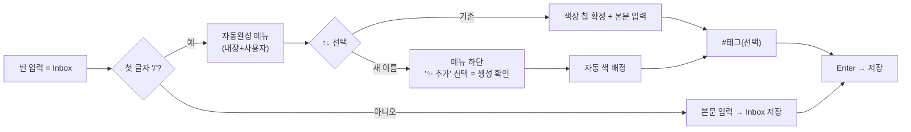

# oxinot — 카테고리 시스템 설계 (수동 색상 → 카테고리 파생 색상)

- **Date:** 2026-07-30
- **Status:** Draft (디자인 확정, 구현 계획 대기)
- **Scope:** 데스크톱 프론트엔드 + Rust 코어 + Tauri 브리지 + `config.toml`. 단일 기능("카테고리 분류 체계로 색상 대체 + 슬래시 빠른 캡처").

## 1. 배경 & 목표

현재 oxinot은 노트마다 **수동 oklch 색상**(`NoteColor`)을 캡처/편집에서 직접 고르고, 사이드바 색상 스왓치로 필터링한다. 문제: 색상이 **라벨링 비용만 들고 의미는 없다** — 빨강을 골라도 빨강이 무엇을 의미하는지 정해지지 않는다. 매 색상 결정이 사고 비용이며 분류 체계로 귀결되지 않는다.

목표:

1. **카테고리 = 핵심 분류** — 색상은 카테고리에서 **파생**된 의미 표현이 된다. 색을 고르는 게 아니라 *어디에 둘지*를 고른다.
2. **슬래시 빠른 캡처** — 캡처 입력창에서 `/note`,`/todo` 등으로 카테고리를 키보드만으로 지정(files.md/oxios 방식). 아무 `/` 없이 입력하면 `inbox`로.
3. **역할 분담** — 카테고리(노트당 **1개**, "장소") + `#태그`(다중, 횡단)의 명확한 이원화. 두 시스템이 겹치지 않음.

## 2. 결정 요약 (locked)

| # | 결정 | 근거 |
|---|------|------|
| 1 | 카테고리 = 핵심 분류, 색상은 **완전 파생** | 사용자 명시("색상은 의미 없다, 카테고리 색이 노트 색이 된다"). 단일 진실 공급원. |
| 2 | 노트당 카테고리 **1개** (기본 `inbox`) | 카테고리 = "집"/"서랍". 횡단 분류는 이미 있는 `#태그` 담당. 슬래시 단일 선택 = 단순. |
| 3 | **고정 기본 6종 + 사용자 확장** | 기본 세트로 즉시 사용 + 유연성. 빠른 캡처의 근육 기억과 커스터마이징 모두. |
| 4 | `category` 프론트매터 필드, `color` **제거** | 정규화. 색상은 `config.toml` 레지스트리에서 읽기시 계산. serde가 알려지지 않은 필드 무시(`Frontmatter`에 `deny_unknown_fields` 없음 확인) → 구형 파일의 `color=` 줄은 안전하게 무시됨. |
| 5 | 새 카테고리 = **캡처 중 명시 선택으로 생성** | `/새이름` 입력 후 메뉴 최하단 "✨ 추가" 항목 선택 = 확인. 오타 무단 생성 방지 + 캡처 흐름 유지. |
| 6 | 슬래시 메뉴 = **자동완성 드롭다운 + 칩 확정** | `/`로 열고 ↑↓ 선택, 즉시 색상 칩으로 시각 확정. 본문 입력과 분리. |
| 7 | 마이그레이션 = **재작성 없음(M2), inbox 기본** | 인라인태그 스펙(§5) 선례 + 프리릴리즈 단일 사용자 + 색상 무의미. M1(재작성)은 대안. |
| 8 | 해시 = `hash_note(body, pinned, **category**)` | 카테고리 변경 = 의미 있는 변경으로 동기화 diff에 잡힘. 현재 `color` 자리 교체. |
| 9 | **Orphan 카테고리 = 읽기시 `inbox` 폴백** | 알 수 없는/삭제된 category id는 렌더링이 깨지지 않게 inbox 중성색으로 폴백(§4.6). |

## 3. 기본 카테고리 세트

| 슬래시 | id | 색상(oklch) | 용도 |
|---|---|---|---|
| *(없음)* | `inbox` | `oklch(0.72 0.01 250)` 중성 그레이 | 기본. 미분류 임시 홈 |
| `/note` | `note` | `oklch(0.70 0.14 250)` 블루 | 일반 메모 |
| `/todo` | `todo` | `oklch(0.75 0.15 75)` 앰버 | 할 일 |
| `/idea` | `idea` | `oklch(0.72 0.15 310)` 퍼플 | 아이디어·영감 |
| `/bookmark` | `bookmark` | `oklch(0.75 0.12 195)` 틸 | 링크·참고 자료 |
| `/code` | `snippet` | `oklch(0.75 0.13 145)` 그린 | 코드 조각 |

- 6종은 `builtin = true`로 **삭제 불가**. id·색 편집은 설정에서(비목표 v1: 고정).
- 사용자 추가 카테고리는 동일 레지스트리에 `builtin = false`로.
- 색상값은 기존 `COLOR_PRESETS` 휴(§7.7 안전 범위 L≈0.70–0.75, C≈0.12–0.15) 재사용 + inbox용 중성 1종 추가.

## 4. 데이터 모델 & API 변경

### 4.1 Note / Frontmatter

```toml
+++
id = "0195..."
created_at = "2026-07-30T..."
updated_at = "2026-07-30T..."
hash = "b3:..."
pinned = false
category = "todo"          # 신규. 기본 "inbox"
tags = []
deleted_at = ...
+++
본문...
```

- `Note`/`NoteSummary`: `color: NoteColor` → `category: String`(`#[serde(default)]`, 기본 `"inbox"`)로 교체.
- `NoteColor` 타입(뉴타입)은 Note에서 제거. 레지스트리 색상은 평범한 oklch `String`.
- `Frontmatter`(`store/files.rs`): `color` 필드 제거, `category` 추가(`#[serde(default = "default_inbox")]`).
  - **전방 호환**: serde는 기본적으로 알려지지 않은 필드를 무시(`Frontmatter`에 `deny_unknown_fields` 없음 확인)하므로 구형 파일의 `color = "..."` 줄이 파싱을 깨뜨리지 않음. `category`가 없으면 기본 `inbox`.
- `note::COLOR_PRESETS`는 레지스트리 기본값 생성용으로 유지(또는 `config.rs`로 이동).

### 4.2 카테고리 레지스트리 (`config.toml`)

기존 `[color]` 섹션(`ColorConfig`, 프리셋 배열)을 **제거**하고 새 `[categories]` 섹션으로 교체:

```rust
// config.rs
#[derive(Debug, Clone, Serialize, Deserialize)]
#[serde(default)]
pub struct CategoriesConfig {
    /// 순서가 보존되는 카테고리 목록. 기본 = 6개 내장.
    pub items: Vec<CategoryDef>,
}

#[derive(Debug, Clone, Serialize, Deserialize)]
pub struct CategoryDef {
    pub id: String,        // 안정적 슬러그(슬래시 토큰·노트에 저장). NFC 정규화.
    pub color: String,     // oklch 문자열. 색상의 단일 진실 공급원.
    #[serde(default)]
    pub builtin: bool,     // 내장 6종 = true(삭제 불가)
}
```

- `config.toml`의 `[categories]`가 비어 있으면 6개 내장 세트로 기본 채움.
- 색상 변경 = 레지스트리 한 줄 수정 → 모든 노트가 읽기시 재계산(파일 재작성 불필요).
- `schema_version` 1 → 2 상향(레거시 `[color]` 감지 시 자동 제거·무시).

### 4.3 Vault / Tauri 명령 / api.ts

- `Vault::create_note(body, color)` → `create_note(body, category: &str)`.
- `Vault::update_note(id, body, pinned, color)` → `update_note(id, body, pinned, category)`.
- Tauri `create_note`/`update_note` 인자 동기화. `api.ts` 시그니처 동기화(`createNote(body, category)`, `updateNote(id, body, pinned, category)`).
- **카테고리 레지스트리 명령 신규**:
  - `list_categories() -> Vec<CategoryDef>` — 레지스트리 반환(캡처 메뉴·사이드바용).
  - `create_category(id, color?) -> CategoryDef` — 사용자 추가. `id` 충돌·빈값 검증, `color` 생략 시 자동 배정. `builtin` 카테고리 id와 충돌 시 거부.
  - (비목표 v1: `update_category`/`delete_category`. 고정 세트 + 추가만.)

### 4.4 필터 / facets / 검색

```rust
pub struct NoteFilter {
    pub include_tags: Vec<String>,
    pub exclude_tags: Vec<String>,
    pub match_all: bool,
    pub categories: Vec<String>,   // ← colors 대체. 비어있으면 통과, 아니면 category ∈ (OR)
    pub pinned_only: bool,
    pub include_deleted: bool,
}
```

- `list_notes`의 `colors` 파라미터 → `categories`.
- `Facets`의 `colors: Vec<(String,u32)>` → `categories: Vec<(String,u32)>`.
- 매칭 로직 동일 구조(`category_ok = categories 비었거나 note.category ∈ categories`).
- 검색(BM25) 경로의 클라이언트 필터는 `colors`→`categories`로 마이그레이션.

### 4.5 해시 함수 변경

`hash_note(body, pinned, color)` → `hash_note(body, pinned, category)`. 카테고리가 색상 자리를 차지.

- 갱신 호출부: `vault.rs`(create/update/soft_delete/restore), `store/files.rs`(읽기 경로 재해시).
- 기존 해시 테스트에서 `color` 인자를 `category`로 교체. "동일 body + 카테고리 변경 → 해시 변경" 단언 유지(의미 있음).

### 4.6 카테고리 라이프사이클 — Orphan 폴백 규칙

카테고리가 확장 가능하므로 **노트가 참조하는 category id가 레지스트리에 없는 상황**(사용자가 `config.toml`에서 카테고리 제거·id 변경, 또는 외부 편집)이 발생한다. 이때 렌더링이 깨지면 안 된다.

**규칙: 읽기시 폴백.** 알 수 없는 category id는 **어디서든 `inbox` 중성색으로 렌더링**한다. 노트는 결코 렌더 브레이크되지 않는다.

- 구현: 색상 룩업 헬퍼(`colorForCategory`, §7)가 레지스트리에 id가 없으면 `inbox` 색을 반환. Rust 측에서도 동일(`resolve_color(id, &registry) -> inbox fallback`).
- **노트의 `category` 필드는 변경하지 않는다** — id는 그대로 보존. 사용자가 카테고리를 다시 추가하면 원래 색이 복원된다(파괴적이지 않음).
- 필터/패싯: facets의 categories 집계는 실제 category id 기준(레지스트리 무관) — orphan id도 자기 id로 카운트. 단 사이드바 카테고리 리스트는 레지스트리 기준 렌더이므로 orphan id는 리스트에 나타나지 않음(해당 카테고리 필터 불가). orphan 노트는 "모든 노트"에는 보이고(색만 inbox), 어느 카테고리 필터에도 매칭 안 함(숨김 아님).
- 이 규칙은 §5의 M2 지연 마이그레이션 사고(레거시 `color` 무시 → inbox)와 동일한 원리: **id를 쓰되, 레지스트리 매핑이 없으면 inbox로 부드럽게 폴백.**
- rename/delete UI가 비목표 v1이므로, orphan는 사실상 수동 `config.toml` 편집에서만 발생 — 폴백이 이를 우아하게 흡수.

## 5. 마이그레이션 — **결정: M2 (재작성 없음, inbox 기본)**

전환 시 기존 노트 파일의 `color`는 더 이상 읽히지 않고(serde 무시), `category`가 없으므로 **모두 `inbox`로 읽힌다.**

**결정: M2, 파일 재작성 없음.**

- **근거**: (a) 인라인태그 스펙(§5)의 "마이그레이션 없음, 손실 수용" 선례 — 프리릴리즈(v0.2.0) 단일 사용자 로컬. (b) 사용자가 색상을 "의미 없다"고 선언 → 의미 없는 색상을 보존하려 재작성+재해시 패스를 돌릴 가치가 없음. (c) 구현이 단순(1회 패스·플래그·본문 보강 로직 없음).
- **부수효과(수용)**: 기존 색상 코딩이 모두 중성 `inbox`로 붕괴. 역복구 가능(원하면 다시 분류).
- **대안 M1(원하면 선택)**: 업그레이드 시 1회 원시 파일 재작성 패스 — 레거시 `color`를 원시 TOML에서 읽어 휴 근접도로 내장 카테고리 매핑(red→inbox, amber→todo, green→snippet, teal→bookmark, blue→note, purple→idea), `category` 기록 후 `color` 제거·재해시. 시각적 연속성 보존 but 모든 노트 재해시(1회 동기화 diff). **스펙 검토 시 M1로 전환 가능.**

## 6. 캡처 UX — 슬래시 메뉴 + 칩 확정 (`QuickCaptureForm`)



**핵심 상호작용:**

- **`/` 감지**: 입력창이 비어있을 때(또는 칩이 없고 첫 글자가 `/`) 슬래시 메뉴 오픈. 본문 도중 `/`는 일반 문자(태그가 이미 `#`을 쓰므로 충돌 없음).
- **메뉴 항목**: 레지스트리 전체(내장+사용자)를 색점 + id로. 입력 접두사로 필터. ↑↓ 탐색, Tab/Enter 확정, Esc 닫기(텍스트로 복귀).
- **새 카테고리**: 접두사가 기존 id와 불일치하면 메뉴 최하단 "✨ '<typed>' 카테고리 추가" 항목. **이 항목 선택 = 확인**(추가 모달 없음). 자동 색 = 기존 카테고리가 덜 쓴 팔레트 휴 순환.
- **확정**: 선택 즉시 `/...` 텍스트 제거, 본문 **위**에 색상 칩(예: `● todo`) 표시. 칩 클릭 = 메뉴 재오픈(변경). 칩 `✕` = inbox로 복귀.
- **하단 스트립 단순화**: 기존 `ColorSwatches`(7개) **제거**. 남는 것 = 카테고리 칩(상단 표시) + Enter 저장 버튼만. 색상은 카테고리에서 자동.
- **`#태그`**: 본문 인라인 유지. `extractTags`가 저장 시 파싱(변경 없음).
- **저장**: `createNote(body, category)`. category = 칩 상태(없으면 `inbox`).

**컴포넌트 변경:**

- `QuickCaptureForm`: `color`/`onColorChange` props → `category`/`onCategoryChange` + `categories` 레지스트리 prop. 신규 하위: `SlashCategoryMenu`(드롭다운), `CategoryChip`(확정 칩).
- `CaptureOverlay`: `color` state → `category` state(기본 `"inbox"`). `createNote(body, category || "inbox")`.
- `ColorPicker.tsx`(`ColorSwatches`): 캡처 경로에서 **폐기**. (설정의 카테고리 색 편집 UI로 재활용은 비목표 v1.)

## 7. 사이드바 / 그리드 / 카드

**사이드바 재구성:**

1. **모든 노트** (전체 건수) — 기본.
2. **고정됨** (건수).
3. **카테고리** — 레지스트리 순서대로, 색점 + id + 건수(`list_facets`의 categories). **라디오 단일 선택** 필터. `inbox`가 첫 항목. 기존 색상 스왓치 섹션 **제거**(카테고리가 흡수).
4. **태그** — 3상태 복합 필터(AND/OR) 유지. 카테고리(단일·장소) + 태그(다중·횡단) 역할 분담.
5. 하단 사이드바 숨기기.

- `ui` store: `colorFilter`/`toggleColor` → `categoryFilter`/`setCategory`(단일 string|null).
- 카테고리 필터 + 태그 필터는 AND 결합(카테고리 범위 안에서 태그 세분화).

**카드 표시:**

- 기존 `paperFor(note.color)` → `paperFor(colorForCategory(note.category, cats))`. 색상 룩업 헬퍼 신규:
  ```ts
  // color.ts (또는 categories.ts)
  export function colorForCategory(id: string, cats: CategoryDef[]): string {
    return cats.find(c => c.id === id)?.color ?? INBOX_NEUTRAL; // §4.6 orphan 폴백
  }
  ```
- 렌더링 로직(`paperFor`/`edgeFor`)은 동일 — 입력만 카테고리 룩업으로 교체.
- **Orphan 폴백(§4.6)**: 레지스트리에 없는 id → `INBOX_NEUTRAL` 중성색. 노트 결코 렌더 브레이크 안 함.

**카테고리 칩(카드/상세):** 카테고리를 시각적으로 표시하는 작은 색점 또는 라벨(선택). 비목표 v1일 수 있음 — 최소 색점.

## 8. 영향 범위 (blast radius)

수동 `color` → 카테고리 파생 색상 전환은 **약 13+ 지점**:

- **Rust core**: `note.rs`(Note/NoteSummary, `NoteColor`→`category`), `hash.rs`(해시 인자), `config.rs`(`CategoriesConfig`/`CategoryDef`, `[color]`→`[categories]`), `store/files.rs`(Frontmatter), `store/index.rs`·`store/search.rs`(레코드 칼럼·facets·필터), `vault.rs`(create/update 시그니처 + `list_categories`/`create_category`).
- **Tauri**: `src-tauri/src/lib.rs`(명령 래핑 — create/update 인자, 신규 list/create_category).
- **TS**: `types.ts`(`Note.category`, `Facets.categories`, `CategoryDef`), `api.ts`(create/update/listNotes 시그니처 + list/create_category), `tauri.ts`(mock 동기화), `color.ts`(카테고리 룩업), `ui.ts`(colorFilter→categoryFilter).
- **컴포넌트**: `QuickCaptureForm`(슬래시 메뉴+칩, 색상 선택기 제거), `CaptureOverlay`(category state), `Card.tsx`/`CardGrid.tsx`(파생 색), `Sidebar.tsx`(카테고리 리스트, 색상 섹션 제거), `ColorPicker.tsx`(폐기), `NoteEditorForm.tsx`/`NoteDetail.tsx`(카테고리 표시·변경).

## 9. 비목표 (향후)

- 카테고리 색/이름 편집·삭제 UI(`update_category`/`delete_category`). orphan는 §4.6 폴백이 흡수.
- `/todo` 체크박스 마크다운 렌더링 통합(현재 plain text).
- 카테고리별 보기 레이아웃(칸반/리스트).
- M1 마이그레이션(시각 연속성 보존) — §5 참조, 검토 시 전환 가능.
- 카테고리 순서 사용자 재배치(드래그).

## 10. 검증 계획

- **Rust 단위**: `hash_note` category 인자(카테고리 변경→해시 변경). `NoteFilter` `categories` 매칭(빈=통과, 소속 OR). `CategoriesConfig` 기본 6종 생성 + `[color]` 레거시 무시. `create_category` id 충돌 검증. **`resolve_color` orphan 폴백**(알 수 없는 id→inbox 색).
- **빌드**: `cargo build`/`clippy` 경고 0, `tsc -b` + Vite.
- **수동**: 캡처 `/todo`→칩 확정→Enter 저장→그리드에 파생색 표시. `/새이름`→추가 항목→생성→레지스트리 반영. 슬래시 없이 입력→inbox. 사이드바 카테고리 라디오 필터 + 태그 AND 결합. 레거시 파일(`color=` 포함, `category=` 없음)이 깨짐 없이 inbox로 로드(M2). **orphan**: `config.toml`에서 사용자 카테고리 제거 후 해당 노트가 inbox색으로 폴백 렌더(§4.6).
- **재배포**: 프론트 + Rust 코어 변경이므로 `cargo build -p oxinot-desktop --release` + 앱 교체 + `codesign --force --deep -s -` 재서명 필요(임베드 프론트·바이너리 갱신).
