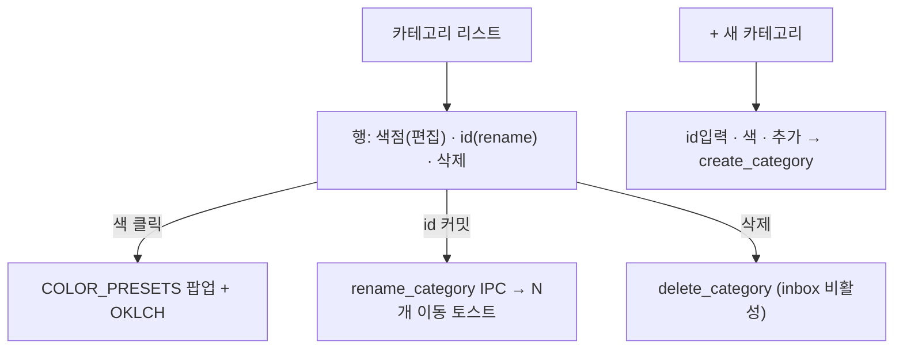

# oximemo — 카테고리 관리·설정·캡처 재설계 (v2)

- **Date:** 2026-07-31
- **Status:** Draft (디자인 확정, 구현 계획 대기)
- **Scope:** 데스크톱 프론트엔드 + Rust 코어 + Tauri 브리지 + `config.toml`. v1 스펙(2026-07-30, 수동 색상→카테고리 파생) 위에 **카테고리 관리·설정 드로어·캡처 재설계·콤보박스**를 추가.
- **선행:** v1 카테고리 시스템은 이미 구현됨(commit `6f0c755` 등). 본 스펙은 그 연장선.

## 0. 배경 & 목표

v1에서 카테고리가 핵심 분류로 자리잡았지만 관리·UX가 미완성이다:

1. **카테고리가 ephemeral** — `create_category`(Tauri)가 `user_categories`(메모리 `Mutex<Vec>`)에만 쌓이고 `config.toml`에 저장되지 않아 **재시작 시 소멸**. v1 스펙은 색/이름 편집·삭제를 비목표로 미뤘다.
2. **설정창이 단순 모달** — 카테고리 관리 섹션 없음. 섹션이 늘어나 flat 구조가 버거움.
3. **inbox 색이 중성이지만 완전 투명 아님** — 분류된 카드와 시각 구분이 약함.
4. **캡처 프론트엔드 UX** — 슬래시 *로직*은 건재하나 셸 디자인을 처음부터 다듬어야 함.
5. **카테고리 선택기가 plain `<select>`** — 키보드 우선·검색·즉시 생성이 안 됨.
6. **P0 — 저장 후 목록 미갱신** — `notes:changed` 이벤트가 메인 윈도우 리스너에 도달하지 않아 create/update 경로가 새로고침되지 않음(별도 진단·수정 병행).

**목표:** 카테고리를 영속적·관리 가능한 1급 객체로 만들고, 설정을 드로어로 재구성하며, 캡처와 선택기 UX를 키보드 우선으로 통일한다.

## 1. 결정 요약 (locked — 본 라운드)

| # | 결정 | 근거 |
|---|------|------|
| 1 | 카테고리 = **`config.toml` 단일 진실 공급원** | ephemeral `user_categories`를 폐기하고 `[categories].items`로 통합. `Vault.config`를 interior-mutable(`RwLock`)로 변경. |
| 2 | **설정 = 우측 사이드 드로어** | 사용자 선택(탭 아님). 넓은 캔버스, 섹션 확장 용이. |
| 3 | 카테고리 **rename 허용 + 노트 마이그레이션** | 사용자 선택. `rename_category(old,new)`가 참조 노트 전부 재작성+재해시+재인덱스. `updated_at` 갱신(동기화 정확성). |
| 4 | **`inbox` id 불변**(색만 편집 가능) | `DEFAULT_CATEGORY`이므로 rename/delete 시 기본값 의미가 붕괴. |
| 5 | inbox 색 = **`""`(투명)** | `paperFor("")`→기본 카드 표면. inbox=미착색 기본, 분류 카드=색 인지. |
| 6 | 캡처 = **슬래시 로직 유지 + 셸 재설계** | 사용자 선택. `SlashCategoryMenu` 파싱·필터 로직 재사용, 입력 셸·레이아웃 처음부터. |
| 7 | 카테고리 선택기 = **공유 Combobox 컴포넌트** | NoteEditorForm `<select>` 교체 + 캡처 슬래시 메뉴가 동일 컴포넌트 기반. |
| 8 | capture→main 갱신 = **`refetchOnWindowFocus` 재활성화**(notes 쿼리) — **§2 진단 결과에 따라 조건부** | 불안정한 교차윈도우 이벤트에 의존 않고, 오버레이 순김 후 메인이 포커스를 되찾을 때 재패치. 단 이벤트가 실제로 정상이라면 불필요 → 로그로 확정 후 결정. |

## 2. P0 — 저장 후 목록 미갱신 (root cause + 수정)

**현상:** 메모 저장(캡처·＋·편집) 후 그리드에 나타나지 않음. 삭제/즐겨찾기는 즉시 갱신됨.

**Phase 1 조사(완료):**
- Rust 코어 41 단위테스트 전 통과(create→redb 인덱스 동기 upsert→`list_notes`→필터). 디스크 vault(18노트+인덱스 3.7MB) 정상.
- `create_note`/`update_note` 커맨드가 `app.emit("notes:changed")` 송출(lib.rs). capability `core:default`가 `core:event:default`(`allow-listen`/`allow-emit`) 포함 → 권한 정상.
- **비대칭(핵심 단서):** `onDelete`/`onToggleFavorite`은 `qc.invalidateQueries(["notes"])` **직접** 호출. 반면 `onNewNote`·NoteDetail autosave는 **오직 `notes:changed` 이벤트**에만 의존. 사용자 확인(삭제/즐겨찾기=즉시, 신규=안 뜸)으로 **이벤트가 런타임에 도달하지 않음**이 확정.

**수정(적용됨, 컴파일 검증 완료):**
- `onNewNote`(CardGrid)·NoteDetail autosave/close-flush에 **직접 `invalidateQueries(["notes"],["facets"])` 추가** — delete/favorite과 대칭화. 동일 윈도우 create/update는 이제 이벤트 무관하게 갱신.
- **진단(임시):** `notes:changed` 리스너에 `console.log("[oximemo] notes:changed received")`, `create_note`/`update_note`에 `tracing::info!` 추가.
- **검증 보류(사용자 실행 필요):** 
  1. ＋/편집 → 즉시 표시되는지(동일 윈도우 수정 확인).
  2. **캡처 진단은 §6.2 라우팅 수정 후에만 실행 가능** (현재 CaptureOverlay 미마운트). 수정 후: ⌘⇧N 캡처 → 메인 그리드 갱신 + devtools 콘솔 `[oximemo] notes:changed received` + Rust 로그 `create_note: emitted notes:changed` 확인 → §8 결정.

> capture→main 교차윈도우 경로는 동일 윈도우 수정으로는 해결 안 됨(캡처 창이 메인의 쿼리 캐시를 직접 무효화 불가). 이벤트 인프라는 캡처 재설계 후에도 잔존하므로, 근본 고장이라면 재설계 캡처까지 영향 → 위 진단으로 반드시 규명.

## 3. 데이터 모델 & 영속성 리팩터

### 3.1 `Vault.config` interior-mutable화

```rust
// vault.rs
pub struct Vault {
    paths: Paths,
    config: parking_lot::RwLock<VaultConfig>,  // ← was: VaultConfig
    files: FileStore,
}
```

- 읽기: `Vault::categories() -> Vec<CategoryDef>`(read lock → clone). 기존 `config()` 호출부(`spawn_watcher`의 `config().capture`/`config().index`, `list_categories`)는 read-guard 또는 캡슐화 메서드로 전환.
- 쓰기: 모든 카테고리 변경 메서드가 write lock 획득 → in-memory config 변경 → `VaultConfig::save()`로 디스크 반영.

### 3.2 `VaultConfig::save()` 신규

```rust
// config.rs
impl VaultConfig {
    pub fn save(&self, paths: &Paths) -> Result<()> {
        let text = self.to_toml()?;
        std::fs::write(paths.config_path(), text)?;
        Ok(())
    }
}
```

- 현재 vault에 `config.toml`이 없음(기본값 사용). 최초 저장 시 전체 기본값이 직렬화되어 파일 생성 — 다른 섹션(general/capture/appearance/index)도 함께 기록되나 모두 기본값이므로 무해.

### 3.3 카테고리 변경 API (core)

```rust
impl Vault {
    pub fn categories(&self) -> Vec<CategoryDef>;                         // 읽기
    pub fn create_category(&self, id: String, color: Option<String>) -> Result<CategoryDef>;
    pub fn update_category(&self, id: String, color: String) -> Result<()>;          // 색 변경
    pub fn rename_category(&self, old: String, new: String) -> Result<u64>;          // 마이그레이션, 반환=이동 건수
    pub fn delete_category(&self, id: String) -> Result<()>;                          // inbox 거부
}
```

- **검증 공통:** `id`/`new` = trim·lowercase·NFC 정규화; 빈값·중복 id 거부; `inbox` rename/delete 거부; `update`/`rename` 대상 id 존재 확인.
- `color` 생략 시 `AUTO_COLORS` 순환 또는 기존 카테고리가 덜 쓴 팔레트 휴(캡처 생성과 동일 정책).
- 모든 변경 → `config.save()` + `notes:changed` 송출은 **Tauri 커맨드 측**에서(코어는 순수).

### 3.4 rename_category 마이그레이션 알고리즘

```text
rename_category(old, new) -> Result<u64>:
  new = normalize(new); 검증(new != old, old 존재, old != "inbox", new 충돌 없음)
  with_redb_and_search(배타 락):
    affected = by_id 전체 스캔, filter category == old
    for rec in affected:
      note = files.read_note(note_path(rec.id, rec.created_at))
      note.category = new
      note.updated_at = now_utc            # 동기화 정확성(export_manifest가 updated_at 커서 사용)
      note.hash = hash_note(body, favorite, new)
      files.write(&note)
      idx.upsert(record_of(&note))
      search.upsert(id, body, tags)        # tags 불변이지만 완전성
  config: CategoryDef{old} → {id:new, color 동일, builtin 동일}
  config.save()
  Ok(affected.len())
```

- **원자성:** 단일 배타 락 범위 내 전 처리. 중간 실패 시 부분 이동 가능하나, `old→new`가 결정론적이므로 재실행으로 멱등 완료.
- **`updated_at` 갱신 결정:** 동기화 매니페스트가 `updated_at` 기준이므로 미갱신 시 rename된 노트가 동기화 누락. 갱신 채택(부수: 영향 노트가 그리드 상단으로 이동 — 희귀 연산이므로 수용).
- rename은 백엔드 배치(수백 건까지 가정). UI는 비동기 + 진행 표시(토스트 "N개 이동").

### 3.5 delete_category

- `inbox` 거부. 그 외: config에서 제거 + save. **참조 노트는 재작성 않음** — orphan가 되어 읽기시 inbox 폴백(v1 §4.6 규칙 그대로). 사용자에게 "N개 노트가 inbox로" 안내 후 확정(파괴적이지 않음: 카테고리 재추가 시 복원).

## 4. Task 1 — 설정 사이드 드로어 + 카테고리 관리

### 4.1 드로어 구조

- `SettingsMenu`를 `Dialog` 모달 → **우측 사이드 드로어**로 전환. 폭 ~380px, 전체 높이, 우→좌 슬라이드 인, 바깥 클릭/Esc 닫기. 헤더에 "설정" + 닫기.
- 세로 섹션(스크롤): **Appearance**(테마·언어) · **Categories**(신규) · **Storage/Vault**(reindex·doctor·경로) · **About**.
- 기존 `Segmented`/`Section` 헬퍼 재사용. 토글 시 `applyTheme` 로컬 적용은 유지.

### 4.2 Categories 섹션



- **행:** 색점(클릭→`COLOR_PRESETS` 스왓 팝업 + OKLCH 입력, `color.ts` 인프라 재사용), id 라벨(인라인 편집 → blur/Enter 커밋 → rename), 삭제 버튼(`inbox` 비활성).
- **새 카테고리 행:** id 입력 + 기본 색 + 추가 버튼 → `create_category`.
- 모든 변경 → 해당 IPC → 성공 시 `["categories"]`·`["facets"]`·`["notes"]` invalidate.
- 빌트인 6종: 색 편집·rename(단, `inbox`는 rename 불가), `inbox` 외 삭제 가능. 사용자 카테고리: 전부 가능.

### 4.3 Tauri 명령 / api.ts

- **신규:** `update_category(id, color)`·`rename_category(old, new) -> u64`·`delete_category(id)`. `create_category`는 `user_categories` 대신 코어(`Vault::create_category`) 위임으로 변경(영속).
- `list_categories`: `user_categories` 병합 제거, `vault.categories()`만 반환.
- `api.ts`: 시그니처 동기화. `tauri.ts` mock 동기화(브라우저 모드).

## 5. Task 2 — Inbox 투명

- `config.rs` `AUTO_COLORS[0]` = `""`(빈 문자열). `CategoriesConfig::default`의 inbox 항목 color `""`.
- `color.ts` `INBOX_NEUTRAL` = `""`. `colorForCategory` orphan 폴백도 `""`.
- `paperFor("")`/`edgeFor("")`는 이미 기본 표면 반환(color.ts:60,66). inbox 카드 = 착색 없는 기본 외관; 분류 카드 = 색 종이. 시각 대비 명확.
- **주의:** 기존 노트의 `category = "inbox"`는 그대로. 레지스트리 색만 `""`로.

## 6. Task 3 — 캡처 프론트엔드 재설계 (슬래시 로직 유지)

`SlashCategoryMenu`의 파싱·필터·생성 로직은 재사용. **셸(레이아웃·입력·크루마)을 재작성.**

### 6.1 타겟 UX

- **보더리스 유리 캡슐:** 하단 중앙 부양, 반투명 블러 + 연한 그림자, 모든 창 위. 크루마 없음.
- **단일 입력 영역:** 1줄 시작, 내용에 따라 ~5줄까지 자동 성장 후 내부 스크롤. 편안한 타입 사이즈.
- **카테고리 표시:** 선택 카테고리 = 입력 **위** 작은 색 칩(또는 선행 컬러 토큰). `/` 입력 시 입력 **위**에 필터 메뉴 부양(색점+id, 타이핑 필터, ↑↓+Enter, "✨ 새 카테고리 추가" 행). 칩 클릭 = 메뉴 재오픈.
- **키보드 전용:** 버튼 없음. `Enter` 저장 · `Shift+Enter` 줄바꿈 · `Esc` 닫기 · `/` 카테고리. 하단에 희미한 `↵ 저장 · esc 닫기` 힌트.
- **저장 흐름:** `createNote(body, category||"inbox")` → 성공 → 창 숨김(park). 메인 그리드는 §8(refetchOnWindowFocus, 조건부)로 갱신.
- **자동 해산:** 저장 직후 blur 자동 숨김.

### 6.2 `/capture` 라우팅 — 확정된 결함 (캡처가 동작하지 않음)

**결함(정적 분석으로 확정):** capture 윈도우 config에 `url` 없음(tauri.conf.json) → `/` 로드. `show_capture`(lib.rs)는 size/position/show/focus만 수행하고 url/navigate 설정은 없음. `isRouteCapture()`(window.ts)가 `pathname.startsWith("/capture")`로 분기하므로 **capture 윈도우의 pathname은 `/` → false → `<Shell/>`(CardGrid) 렌더, `<CaptureOverlay/>`는 마운트되지 않음**. 즉 ⌘⇧N은 잘린 그리드를 보여줄 뿐 입력창이 아님 — 이것이 "캡처를 처음부터 다시"의 진짜 원인.

**수정(라벨 기반 분기, 더 견고):** `isRouteCapture()`를 창 라벨로 판단 — Tauri 모드 `getCurrentWindow().label === "capture"`, 브라우저 모드 폴백으로 `pathname.startsWith("/capture")` 유지. config의 url에 의존 않고 라벨로 확정 분기. (대안: tauri.conf capture 윈도우에 `"url": "capture"` 추가 — 덜 견고, config 결합.)

> **순서 의존:** 본 결함 때문에 §2의 캡처 진단(이벤트 도달 여부)은 §6.2 수정 전에 **실행 불가** — CaptureOverlay가 마운트되지 않으니 캡처 저장 자체를 테스트할 수 없음. 따라서 §6.2 수정이 §8 진단에 선행. (사용자 런타임 확인 권장: ⌘⇧N이 실제로 무엇을 보여주는지 — 정적 분석은 견고하나 시각 확정이 유익.)

### 6.3 컴포넌트 변경

- `QuickCaptureForm`: props 구조 정리, 셸 재작성. `SlashCategoryMenu`·`CategoryChip`은 로직 유지·스타일 재작업.
- `CaptureOverlay`: 상태 관리 유지, 레이아웃 교체. `save()` 흐름 유지.

## 7. Task 4 — 공유 Combobox 컴포넌트

NoteEditorForm의 plain `<select>` 교체 + 캡처 슬래시 선택의 공통 기반.

```text
CategoryCombobox:
  trigger = 현재 카테고리 칩(색점+id) · 클릭/포커스로 오픈
  패널 = 필터 입력 + 목록(색점+id+건수?) · 최대 높이 스크롤(한번에 전개 금지)
  동작 = 타이핑 필터 · ↑↓ 이동 · Enter 선택 · Esc 닫기
  "✨ '<typed>' 생성" 행(정확 매치 없을 때) → create_category 인라인
```

- 키보드 우선, search-as-you-type, capped scroll, 즉시 생성. `@base-ui` 프리미티브 활용 가능(구현 시 확인).
- NoteEditorForm: `<select>` → `<CategoryCombobox>`. 캡처: 슬래시 메뉴가 동일 리스트 렌더링/필터 로직 공유(컴포넌트 분리 또는 훅 추출).

## 8. capture→main 갱신 (§6.2 라우팅 수정 후 진단, 결과에 따라 조건부)

- **진단 결과가 "이벤트 도달 안 됨":** `App.tsx` QueryClient 기본 `refetchOnWindowFocus: false` → **notes 쿼리만 `refetchOnWindowFocus: true`** 오버라이드. 캡처 창 숨김 후 메인이 포커스 되찾을 때 `["notes"]` 재패치 → 캡처 노출. 이벤트 의존 제거.
- **진단 결과가 "이벤트 정상 도달":** §8 불필요. 이벤트 경로 그대로 사용(캡처→메인 자동 갱신). 이 경우 진단 로그(console.log/tracing) 제거.

## 9. 영향 범위 (blast radius)

- **Rust core**: `config.rs`(`save()`, inbox 색 `""`, `AUTO_COLORS[0]`), `vault.rs`(config `RwLock`화, `categories`/`create_category`/`update_category`/`rename_category`/`delete_category`), `note.rs`(불변, 단 `rename`이 `hash_note` 재사용).
- **Tauri**: `lib.rs`(`update_category`/`rename_category`/`delete_category` 명령, `create_category`/`list_categories`를 코어 위임으로 변경, `AppState.user_categories` 제거).
- **TS**: `api.ts`(신규 명령 래핑), `tauri.ts`(mock 동기화), `color.ts`(inbox `""`), `types.ts`(변경 없음).
- **컴포넌트**: `SettingsMenu`(드로어 전환 + Categories 섹션), 신규 `CategoryCombobox`, `NoteEditorForm`(`<select>` 교체), `QuickCaptureForm`/`CaptureOverlay`(셸 재설계), `App.tsx`(refetchOnWindowFocus, 조건부).
- **P0(이미 적용)**: `CardGrid.tsx`(`onNewNote` invalidate, 리스너 진단 로그), `NoteDetail.tsx`(autosave/close invalidate), `lib.rs`(`tracing` 진단).

## 10. 비목표 (향후)

- 카테고리 순서 드래그 재배치.
- 카테고리별 보기(칸반/리스트).
- `/todo` 체크박스 마크다운 렌더링.
- delete_category 시 "노트를 inbox로 이동" 자동 마이그레이션(현재는 orphan 폴백만).
- 캡처 `↑` 직전 입력 회상.

## 11. 검증 계획

- **Rust 단위**: `VaultConfig::save()` 라운드트립(변경→재로드). `rename_category` 마이그레이션(참조 노트 category·hash·updated_at 갱신, 비참조 노트 불변, 동기화 매니페스트에 포함). `update_category`/`delete_category` 검증(inbox 거부, 중복 거부). inbox 색 `""`로 `resolve_category_color`/`paperFor` 정상.
- **빌드**: `cargo build`/`clippy` 경고 0, `tsc -b` + Vite.
- **P0 런타임(사용자, 차단)**: ＋/편집 → 즉시 그리드 표시. 캡처 → devtools 콘솔 `[oximemo] notes:changed received` + Rust 로그 `create_note: emitted notes:changed` 출력 확인 → §8 필요성 판정.
- **수동**: 설정 드로어 열기/닫기·섹션. 카테고리 색 편집→그리드 즉시 반영. rename→영향 노트 이동·재시작 후 유지. 새 카테고리 생성→재시작 후 유지. delete→orphan inbox 폴백. inbox 투명 렌더. 캡처 슬래시 메뉴·칩·Enter 저장. Combobox 타이핑 필터·즉시 생성.
- **재배포**: 프론트+코어 변경 → `cargo build -p oximemo-desktop --release` + 앱 교체 + `codesign --force --deep -s -` 재서명.
