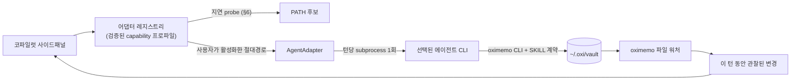

# 코파일럿 패널 — 터미널 에이전트 CLI 위임

- 날짜: 2026-08-23
- 상태: 설계 확정, 구현 전
- 선행 문서: `2026-08-18-brain-knowledge-integration-design.md`, `2026-08-23-collections-metadata-settings-design.md`
- 외부 캐노니컬: `oxibrain/doc/ECOSYSTEM.md` v1.1 §3.1·C1·C5, `oxios/docs/rfc-050-vault-unification.md`
- 트리거: "앱에 코파일럿을 내장하는 건 어떤가 — 생태계 전체로 봤을 때" 논의. 3차에 걸친 아키텍처 개정(oxios HTTP 종속 → oxios CLI 종속 → 범용 터미널 에이전트 위임)의 최종안.

## 1. 배경

oximemo는 **캡처 속도**를 지키기 위해 앱 내 AI를 명시적으로 배제해 왔다. README 인용:

> There is no AI summary, no auto-tagging, no chatbot — those trade away the capture speed and reliability this project exists to protect.

이 문구는 앱 전체에 대한 영구 선언으로 읽히지만, 실제 보호 대상은 **캡처 경로**다. 그리고 지형이 바뀌었다:

- **RFC-050(2026-08-22)** — `~/.oxi/vault/`가 oximemo·oxios 공유 파일 공간이 됐다. oxios 에이전트는 **이미** 이 vault에 노트를 쓴다. oximemo가 실행 중이 아니어도 마찬가지다.
- **`oximemo` CLI + `skills/oximemo/SKILL.md`** — 외부 에이전트가 vault를 안전하게 다루는 계약이 이미 배포돼 있다.
- 즉 "에이전트가 내 노트를 써 준다"는 기능은 **이미 생태계에 존재한다.** 없는 것은 oximemo UI 안에서 그것을 지시할 창구뿐이다.

따라서 이 스펙은 새 지능을 만들지 않는다. **이미 존재하는 에이전트에게 일을 의뢰하는 UI**를 만든다.

## 2. 목표 / 비목표

**목표**

- 전역 사이드패널에서 사용자가 vault·현재 메모에 대해 작업을 의뢰한다(노트 작성, 정리, 태그 제안 등).
- 실행 주체는 **사용자 PC에 이미 설치된 터미널 에이전트 CLI**다. 특정 앱에 고정하지 않는다.
- oxios가 없어도, 아무 에이전트가 없어도 oximemo는 완결된 앱으로 남는다.

**비목표 (하드 제약)**

- oximemo 안에 모델·프롬프트·임베딩·툴콜링 루프를 두지 않는다.
- 특정 앱의 사설 HTTP/WS 프로토콜에 의존하지 않는다.
- 자체 승인·권한·샌드박스 정책을 재구현하지 않는다.
- 캡처 오버레이 경로(`Option`×2 → 오버레이 → 저장)를 단 1ms도 건드리지 않는다.
- provider API 키를 oximemo가 보관·관리하지 않는다.

## 3. 지켜야 할 캐노니컬 가드레일

`oxibrain/doc/ECOSYSTEM.md` §3.1이 oximemo에 부과한 두 가지:

1. **캡처 경로 불가침** — "≤16 ms budget is CI-measured, not a past achievement."
2. **"no AI" 약속 유지** — "oximemo still contains no model, no **prompt**, no embedding."

§C1(브레인은 additive, never load-bearing)과 §C5(vault 공유 3원칙: `oxi-frontmatter` 원자적 쓰기 / vault 내 파생 상태 금지 / 파일 단위 last-writer-wins)도 그대로 적용된다.

**이 설계가 §3.1-2를 지키는 방식**: oximemo는 **지시문(prompt)을 저술하지 않는다.** 에이전트에게 넘기는 것은 기계적 사실만 담은 **선언적 컨텍스트 블록**이며(§7), 행동 규칙은 이미 배포된 `SKILL.md`를 **가리키는 것**으로 대체한다. oximemo 저장소 어디에도 모델을 향한 자연어 지시 문자열이 존재하지 않는다.

## 4. 아키텍처



핵심 성질:

- **호출 방향의 반전**: 지금까지 에이전트가 `oximemo` CLI를 호출했다. 이제 oximemo가 에이전트 CLI를 호출한다. 양방향 모두 **CLI가 계약면**이며, 새 프로토콜이 발명되지 않는다.
- **턴 = subprocess 1회**. 상주 프로세스도 PTY도 없다. 실패 격리·취소·재시작이 단순하다.
- oximemo는 에이전트 런타임도, provider 호스트도, oxios 클라이언트도 아니다.

## 5. 어댑터 계약

에이전트마다 다른 것은 "1턴을 실행하는 방법"뿐이다. 이를 capability 선언형 어댑터로 흡수한다. `invoke()` 단일 함수로 뭉개면 조건문 덩어리와 조용한 실패가 되므로, **지원하지 않는 기능은 UI에서도 사라져야 한다.**

```rust
// 형태 스케치 — 구현 시 확정
struct AgentCapabilities {
    structured_result: bool,   // 최종 결과를 파싱 가능한 형식으로 반환
    resumable_session: bool,   // 세션 id로 멀티턴 재개
    cancellable: bool,         // 안전한 중단 지원
    interactive_input: bool,   // 실행 중 사용자 입력 요구를 표면화 가능
}

trait AgentAdapter {
    fn id(&self) -> &'static str;
    fn probe(&self, exe: &Path) -> Result<ProbeResult>;      // 버전 + capability 확정
    fn start_turn(&self, req: TurnRequest) -> Result<TurnHandle>;
    fn resume(&self, session: &SessionRef, req: TurnRequest) -> Result<TurnHandle>;
    fn cancel(&self, handle: &TurnHandle) -> Result<()>;
    fn provider_disclosure(&self, exe: &Path) -> Disclosure; // §12
}
```

- `resumable_session = false`인 어댑터는 멀티턴 UI를 제공하지 않는다(대화 전문 자동 재전송 **금지** — 비용·민감정보·컨텍스트 초과 위험).
- `interactive_input = false`인 어댑터가 입력을 기다리며 멈추면 타임아웃으로 종료하고 "이 에이전트는 GUI 승인 상호작용을 지원하지 않음"을 표시한다.
- capability는 추측하지 않는다. `probe`로 실측된 것만 신뢰한다.

## 6. 탐지 · 활성화 · 검증

**탐지는 신뢰 경계가 아니다.** `PATH`에 이름이 있다는 사실만으로 실행하면 alias·shim·바꿔치기를 신뢰하게 된다.

1. **지연 probe** — 앱 시작 시 절대 실행하지 않는다. 코파일럿 패널 최초 오픈 또는 설정 "연동 → 코파일럿" pane 진입 시에만. (§3.1 가드레일 1: probe는 후보당 `--version` subprocess이므로 수십~수백 ms. 시작 경로/오버레이 워밍업에 얹히면 CI 측정 예산을 직접 깎는다.)
2. **후보 제시** — 발견된 것을 목록으로만 보여준다. 자동 활성화 없음.
3. **명시적 활성화** — 사용자가 고른 항목에 대해 `{canonical_absolute_path, version, capabilities, exe_mtime}`를 설정에 저장.
4. **재검증** — 이후 실행 시 저장된 절대 경로로만 호출하고, `exe_mtime`/version이 바뀌었으면 재probe 후 사용자에게 알린다.
5. **미탐지/미활성** — 코파일럿 진입점(아이콘·단축키) 자체를 숨긴다. "설치하세요" 넛지 없음. (§C1 정신: 통합은 비활성 패널로 degrade하며, 막힌 동작이나 스피너가 되지 않는다.)

## 7. 컨텍스트 전달 — 선언적, 지시문 없음

oximemo가 에이전트에게 넘기는 것은 **사실의 나열**이다.

```
vault_root: /Users/<u>/.oxi/vault
cli: <앱 번들의 oximemo 사이드카 절대 경로>
skill: <앱 번들 리소스의 SKILL.md 절대 경로>
active_memo:
  id: 01991a2e-...
  title: ...
  path: memos/2026/08/....md
user_request: <사용자가 패널에 입력한 원문>
```

**`cli`/`skill` 경로는 앱 번들에서 해석한다 — 사용자 PATH에 의존하지 않는다.**

- `cli` — `tauri.conf.json`이 이미 `externalBin: ["binaries/oximemo"]`로 CLI를 사이드카 번들한다. 따라서 에이전트에게 **번들된 바이너리의 절대 경로**를 넘긴다. 사용자가 CLI를 별도 설치하지 않았거나 PATH에 없어도 코파일럿이 성립하고, 앱 버전과 CLI 버전의 불일치도 구조적으로 발생하지 않는다.
- `skill` — `SKILL.md`는 **현재 번들되지 않는다**(`tauri.conf.json`에 `bundle.resources` 키 부재, CLI에도 `skill install` 서브커맨드 없음 — `doc/DESIGN.md` §10.2에서 Phase 2 후보로만 언급). 따라서 **`skills/oximemo/`를 `bundle.resources`에 추가하는 것이 이 기능의 선행 구현 항목**이다. 저장소 경로를 런타임에 참조하는 것은 배포 빌드에서 존재하지 않으므로 금지.
- **vault 전체를 주입하지 않는다.** 에이전트가 필요한 만큼 `oximemo search / get / list`로 가져간다. 이는 §12(외부 전송 최소화)와 컨텍스트 비용 양쪽에 이롭다.
- **행동 규칙을 문장으로 쓰지 않는다.** `skill` 경로를 가리키는 것으로 끝낸다. `SKILL.md`는 이미 안전한 직접 쓰기 규칙과 CLI 사용법을 담고 있는 배포된 계약이다.
- `user_request`는 사용자 원문이며 oximemo가 가공하지 않는다.

## 8. 턴 수명주기

v1이 반드시 제공하는 것:

| 항목 | 내용 |
|---|---|
| 시작 | 시작 시각 표시, 실행 중 상태(스트리밍 없음 — 다중 에이전트 공통분모) |
| 취소 | 사용자 취소 시 **process tree 종료**(자식 프로세스 잔존 방지) |
| 타임아웃 | 설정 가능한 상한, 초과 시 동일한 tree 종료 경로 |
| 오류 | exit code + stderr 원문을 패널에서 열람 가능 |
| 결과 | 최종 출력 원문 보존. `structured_result` 어댑터는 파싱된 요약도 함께 |

토큰 스트리밍은 v1 범위 밖(§17). 어댑터별 출력 형식이 제각각이라 균일 구현이 불가능하고, "실행 중 → 완료 시 전체 응답"으로도 코파일럿 UX는 성립한다.

## 9. vault 쓰기 안전과 "관찰된 변경"

**보장하는 것**: 에이전트에게 `oximemo` CLI와 `SKILL.md`를 알려준다. oxios처럼 `oxi-frontmatter` 계약을 따르는 에이전트는 원자적 쓰기를 한다.

**보장하지 않는 것 (문서에 명시할 것)**: 범용 터미널 에이전트는 raw `.md` 편집·임의 shell 실행이 가능하다. oximemo는 이를 막을 수 없다. 따라서 **"에이전트의 vault 변경이 항상 계약을 따른다"고 약속하지 않는다.** 실제 제약은 사용자가 고른 에이전트의 샌드박스·승인 정책에서 나온다(§11).

**변경 표시의 인과 귀속 금지**: 공유 vault에서 턴 도중 관찰된 파일 변경이 그 에이전트의 것이라는 보장은 없다 — §C5에 따라 oxios·Obsidian·다른 CLI가 동시에 같은 트리에 쓸 수 있고, oximemo 워처는 디바운스된다. 따라서 UI 라벨은 반드시:

- ✅ **"이 턴 동안 변경된 노트"** (항상 참)
- ❌ "에이전트가 수정한 노트" (거짓 가능)

링크 제공이라는 실용적 가치는 유지하면서 거짓 주장을 하지 않는다. 에이전트가 스스로 보고한 변경 목록은 **힌트**로만 취급하고, 사실의 원천은 oximemo가 관찰한 파일 변화다.

## 10. 동시 수정 충돌

§C5는 파일 단위 last-writer-wins를 명시한다. 사용자가 MemoDetail에서 편집 중인 파일을 에이전트가 바꾸면 조용한 덮어쓰기가 발생할 수 있다.

- 턴 시작 시 **현재 열린 메모의 revision/해시를 기록**한다.
- 턴 종료 후 그 파일이 사용자 쪽 편집으로도 바뀌었다면, 자동 반영으로 처리하지 않고 **충돌 상태를 패널에 노출**한다.
- v1은 자동 병합을 시도하지 않는다. 사실을 보여주고 사용자가 결정한다.

## 11. 승인 · 권한 위임

- oximemo는 승인 UI도, 게이팅 로직도 갖지 않는다. 선택된 CLI의 기존 비대화형 정책을 그대로 상속한다.
- **oximemo가 권한 우회 플래그를 자동으로 붙이는 것은 금지한다.** 정책 위임은 자동 승인 강제가 아니다. 사용자가 자기 에이전트 설정에서 켠 것만 유효하다.
- `interactive_input` capability가 없는 어댑터에서 프로세스가 승인 대기로 멈추면 §8의 타임아웃 경로로 종료하고 원인을 명시한다(GUI에서 멈춘 subprocess는 원인 불명이 최악이다).

## 12. 프라이버시 · 외부 전송 동의

oximemo의 정체성 문구는 "no cloud"다. 사용자가 외부 provider를 쓰는 에이전트를 활성화하는 순간 메모 본문이 그 provider로 나갈 수 있다.

- **최초 활성화 시 1회 명시적 동의** — 어떤 에이전트를 실행하는지, 그것이 어떤 provider를 쓰도록 설정돼 있는지(`provider_disclosure`로 확인 가능한 범위), 무엇이 전송될 수 있는지.
- **패널 헤더에 현재 에이전트·provider를 상시 표시.**
- v1이 oxios 단일 어댑터라도 이 UI는 **어댑터 2호가 붙기 전에 존재해야 한다.**
- oximemo는 API 키를 저장·전달하지 않는다. 자격증명은 전적으로 에이전트 CLI 소유다.

## 13. v1 어댑터 — oxios

문서화된 프로그램적 계약이 있어 기준점으로 가장 안전하다. `oxios/README.md` "Programmatic Usage"가 명시:

```bash
oxios run --json "..."                      # 구조화 출력
oxios run --json --session "$SID" "..."     # 멀티턴 재개
oxios run --exit-code --json "..."          # CI용 종료 코드 (0=passed, 1=failed)
cat file | oxios run --json --context-file - "..."
```

JSON 출력에 `response`, `session_id`, `phase_reached`, `evaluation_passed`, `exit_code`, `duration_ms`가 포함된다.

→ capability: `structured_result = true`, `resumable_session = true`. `oxios run`은 스크립트/에이전트용으로 설계됐다고 README에 명시돼 있어 비대화형 실행이 검증된 경로다.

**다른 에이전트(oxicode / Claude Code / Codex / OMP 등)는 v1에서 "발견됨"까지만 표시하고 활성화 대상에서 제외한다.** 각자의 비대화형 계약을 실제로 probe·검증한 뒤 어댑터를 추가한다. 검증 없는 추측 어댑터를 붙이지 않는다.

## 14. 설정 · config

`oximemo.toml`에 `[copilot]` 섹션을 추가한다. `BrainConfig`와 동일한 `#[serde(default)]` 패턴.

```toml
[copilot]
enabled = true          # 마스터 스위치
agent = ""              # 활성화된 어댑터 id (빈 값 = 미설정)
executable = ""         # 검증된 절대 경로
timeout_secs = 300
```

설정 UI는 기존 좌측 레일의 **"연동" 그룹**(브레인·메타데이터와 나란히)에 "코파일럿" pane으로 붙는다. pane 내용: 마스터 토글, 탐지 실행 버튼, 후보 목록(경로·버전·capability 표시), 활성화/해제, provider 고지, 타임아웃.

## 15. 패널 UX

- 전역 사이드패널. **`⌘⇧C`** + 아이콘 토글. 기존 바인딩 전수 확인 결과 충돌 없음 — 프런트엔드는 `⌘N`(새 노트)·`⌘K`/`⌘⇧O`(팔레트)·`⌘↑`(상위 폴더)·`⌘Enter`(MemoDetail 닫기), Rust 전역은 `⌘⇧N`(캡처, `default_shortcut()`)만 점유한다. `⌘K` 브랜치와 동일한 가드 패턴을 따른다(팔레트 모달 열림 시 불활성, MemoDetail 포커스 규칙 준수).
- 메모가 열려 있으면 `active_memo` 자동 포함, 없으면 vault 범위.
- 대화는 **하나의 어댑터에 고정**. 패널에서 에이전트를 바꾸면 새 대화를 시작한다(세션 id는 어댑터 간 호환되지 않는다). 과거 대화 이관은 v1 범위 밖.
- 헤더: 현재 에이전트 · provider · 새 대화 버튼.
- 결과 블록: 최종 응답 원문 + "이 턴 동안 변경된 노트" 링크 + (있으면) stderr/exit code 열람.

## 16. 실패 모드

| 상황 | 동작 |
|---|---|
| 활성 에이전트 없음 | 진입점 숨김 |
| 실행 파일이 사라짐/변경됨 | 재probe, 사용자에게 알림, 자동 재활성화 금지 |
| 프로세스가 승인 대기로 정지 | 타임아웃 → tree 종료 → 원인 명시 |
| 비정상 종료 | exit code + stderr 노출, 대화 상태 보존 |
| 턴 중 사용자가 같은 파일 편집 | 충돌 상태 노출(§10) |
| 에이전트가 vault를 깨뜨림 | 워처가 파싱 실패를 이미 처리. `oximemo doctor` 안내 |

## 17. 범위 밖 (v1)

토큰 스트리밍 · 어댑터 2호 이상 · 대화 이관 · 자동 병합 · oximemo 자체 승인 UI · 백그라운드/예약 실행 · 캡처 오버레이 통합.

## 18. 선행 구현 항목 · 남은 미해결

**선행 항목 (§7이 요구하는 것, 코파일럿 코드보다 먼저)**

1. `skills/oximemo/`를 `tauri.conf.json`의 `bundle.resources`에 추가하고 런타임에서 리소스 절대 경로를 해석한다. 현재 번들되지 않으므로 이것이 없으면 `skill` 포인터가 배포 빌드에서 깨진다.
2. 사이드카 `binaries/oximemo`의 런타임 절대 경로 해석 경로를 확정한다(`externalBin`은 이미 선언돼 있다).

**남은 미해결 (구현 계획 단계에서 실측)**

3. `provider_disclosure`가 oxios에서 실제로 무엇을 조회할 수 있는지(설정 파일 읽기 vs `oxios models`) — 실측 필요. 조회 불가로 판명되면 §12는 "provider를 특정할 수 없음"을 정직하게 표시하는 쪽으로 축소한다.
4. 어댑터 등록 방식이 코드 내장인지 데이터 선언인지 — v1은 내장 1개라 미결로 둬도 무방.

## 19. 문서 변경 (구현과 함께)

- `README.md` — 22행 반대 목표 문구의 스코프를 캡처 경로로 명확화. 현재 문면은 앱 전체에 대한 무조건적 선언이라 이 기능과 충돌한다.
- `doc/DESIGN.md` — 코파일럿 섹션 추가(위임 모델, 보장하는 것/않는 것).
- `oxibrain/doc/ECOSYSTEM.md` §3.1 — **개정 필요.** 현재 문면은 oximemo의 AI 통합을 "read-only, closable panel"로 한정하고 에이전트 실행 책임을 §3.3(oxios)에 둔다. 외부 CLI를 쓰더라도 oximemo가 에이전트 턴을 개시·관리하면 새 역할이다. 추가할 경계: *"oximemo는 모델을 포함하지 않으며, 사용자가 명시적으로 활성화한 외부 에이전트 CLI를 선택적 디스패처로 실행할 수 있다. 캡처 경로는 불가침이며, vault 쓰기는 frontmatter 계약과 해당 에이전트의 정책을 따른다."* RFC-050이 C5를 개정했던 것과 같은 절차로 처리한다.

## 20. 수용 기준

1. 에이전트 미설치/미활성 상태에서 oximemo의 모든 기존 기능이 무변경으로 동작하고, 코파일럿 진입점이 보이지 않는다.
2. 앱 시작·캡처 오버레이 경로에서 probe subprocess가 단 하나도 실행되지 않는다(CI 측정 예산 무영향).
3. oximemo 저장소에 모델을 향한 자연어 지시 문자열이 존재하지 않는다(선언적 컨텍스트 + `SKILL.md` 포인터만).
4. oxios 어댑터로 멀티턴 대화가 성립하고, 세션 id가 유지된다.
5. 취소 시 자식 프로세스가 남지 않는다.
6. 변경 링크 라벨이 인과를 주장하지 않는다("이 턴 동안 변경된 노트").
7. 어댑터 최초 활성화 시 provider 고지·동의가 표시되고, 패널 헤더에 상시 노출된다.
8. oximemo가 권한 우회 플래그를 자동으로 부착하지 않는다.
9. 릴리스 번들(`.app`)에서 `cli`·`skill` 경로가 모두 실존하며, 사용자 PATH에 `oximemo`가 없어도 코파일럿 턴이 성립한다.
